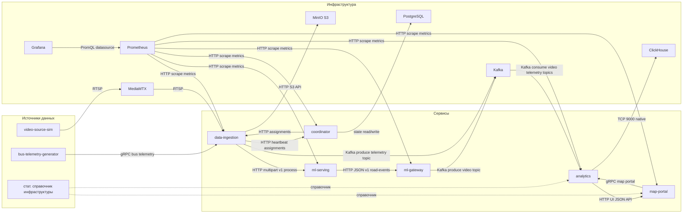
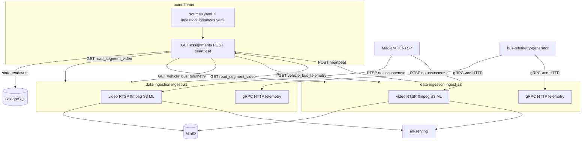

# PIIS: Логическая схема системы

Ниже общая диаграмма сервисов проекта и протоколов взаимодействия.

## Источники данных

- **Потоковые** — синтетические видеопотоки и телеметрия ТС (`video-source-sim`, `bus-telemetry-generator`), далее обработка в `data-ingestion` и шина Kafka.
- **Статическая инфраструктура** — справочные данные по населённым пунктам и остановкам (агрегированная информация о «инфраструктуре города» без привязки к конкретному поставщику или формату хранения в этом документе). Они подмешиваются к рантайму при работе карты и сопоставления сегментов/объектов; детали схемы БД и обновлений см. в репозитории сервисов.

## Взаимодействие с системой

- **Развёртывание и сопровождение** — подъём стека из каталога `infra` одной командой `docker compose` (см. **`infra/README.md`**): инфраструктура (Kafka, ClickHouse, MinIO, Prometheus, Grafana и прикладные сервисы) в общей сети Docker.
- **Наблюдение за работой** — **Grafana** (`http://localhost:3000`): дашборды по Kafka, бизнес-метрикам analytics, доступности сервисов (`up`), CPU/RAM контейнеров (cAdvisor). **Prometheus** — сырьё для запросов и алертов; health критичных сервисов дублируется **blackbox-exporter**.
- **Операционный и UI-слой** — **map-portal** отдаёт HTTP JSON поверх gRPC к **analytics** (карта, справочники в духе муниципалитетов/остановок/ТС — см. README сервиса); это точка входа для сценариев «посмотреть состояние на карте» без прямого доступа к ClickHouse.
- **ML-контур** — `data-ingestion` вызывает **ml-serving** по HTTP; при настройке **`ML_GATEWAY_URL`** результаты уходят в **ml-gateway** → Kafka → **analytics**; ручная проверка: `GET /health` у `ml-serving` и `coordinator`.
- **Координация источников** — инстансы `data-ingestion` получают назначения от **coordinator** (heartbeat, `GET assignments`), состояние — в **PostgreSQL**.

## coordinator и data-ingestion (детально)

Два инстанса `data-ingestion` в одном кластере. Список инстансов — в `ingestion_instances.yaml` у coordinator; `sources.yaml` — только каталог источников. Назначение — по загрузке среди живых инстансов. В production-сценарии coordinator работает в active-active и читает общее состояние из PostgreSQL.

## Ключевые протоколы

- `RTSP` — видеопотоки от симулятора через `MediaMTX` в `data-ingestion`.
- `HTTP` — вызовы ML (`data-ingestion -> ml-serving`) и API-взаимодействия.
- `Kafka` — асинхронная передача событий видео/телеметрии в `analytics`.
- `gRPC` — телеметрия автобусов (`bus.v1`) и API карты (`map.v1`).
- `S3 API` — сохранение кадров в `MinIO`.
- `Prometheus scrape` — сбор метрик, визуализация через `Grafana`.

## Мониторинг и health

- Основные дашборды в Grafana: **`Сервисы`** (Kafka, ошибки, `up`, CPU/RAM контейнеров), **`Ingest, gateway, analytics`** (метрики пайплайна видео/аналитики).
- Health-check `coordinator`/`ml-serving` собирается через `blackbox-exporter`.
- CPU/RAM по docker-сервисам собирается через `cadvisor`.
