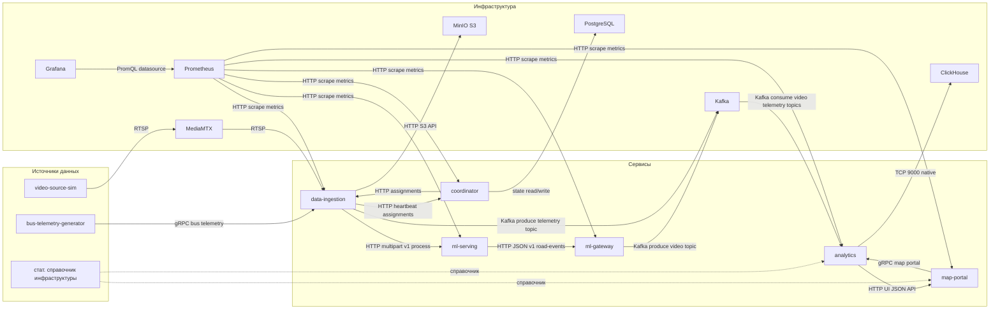

# Описание системы

Распределённый контур: приём **видео** (RTSP) и **телеметрии** (gRPC), вызовы **ML** (`ml-serving`), события через **Kafka** в **analytics**, хранение в **ClickHouse** / **MinIO**, координация источников (**coordinator** + **PostgreSQL**), **map-portal** для API карты. Наблюдаемость: **Prometheus** + **Grafana**, логи контейнеров — **Filebeat → Logstash → Elasticsearch**, просмотр в **Kibana**.

Подробнее по портам, профилям и томам: [`infra/README.md`](infra/README.md). Высокоуровневое описание: [`high-level-design.md`](high-level-design.md). Краткий запуск и таблицы: [`README.md`](README.md).

## Схема системы



## Запуск

**Нужно:** Docker с **Compose V2** (`docker compose`).

```bash
cd infra
docker compose pull
docker compose up --build -d
```

Остановка стека: `cd infra && docker compose down`.

## Управление

| Действие | Команда (из каталога `infra`) |
|----------|-------------------------------|
| Статус контейнеров | `docker compose ps` |
| Логи сервиса | `docker logs -f <имя_контейнера>` |
| Перезапуск одного сервиса | `docker compose restart <сервис>` |
| Видео RTSP без полного стека | профиль **`ingest`**: `docker compose --profile ingest up -d mediamtx video-source-sim` |
| Генератор телеметрии автобуса | профиль **`telemetry`**: `docker compose --profile telemetry up -d bus-telemetry-generator` |
| Правка Prometheus | после изменения `prometheus/prometheus.yml`: `docker compose restart prometheus` |

Детали профилей и очистки только ingest-сервисов — в [`infra/README.md`](infra/README.md).

## Наблюдательность

| Назначение | Где |
|------------|-----|
| **Метрики и дашборды** | **Grafana** http://localhost:3000 (`admin` / `admin` по умолчанию) — папка дашбордов *Traffic*: «Сервисы», «Ingest, gateway, analytics» |
| **Сырые метрики, таргеты** | **Prometheus** http://localhost:9090 |
| **Логи контейнеров** | **Kibana** http://localhost:5601 → Discover, data view **`traffic-docker-logs-*`** |
| **Проверка ML** | `curl -s http://localhost:8000/health` (**ml-serving**) |
| **Карта / HTTP API** | **map-portal** http://localhost:8096 |
| Полный список портов (Kafka, ClickHouse, MinIO, Elasticsearch, coordinator …) | [`infra/README.md`](infra/README.md) |
