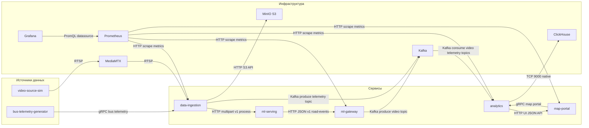

# PIIS: Логическая схема системы

Ниже общая диаграмма сервисов проекта и протоколов взаимодействия.

## Ключевые протоколы

- `RTSP` — видеопотоки от симулятора через `MediaMTX` в `data-ingestion`.
- `HTTP` — вызовы ML (`data-ingestion -> ml-serving`) и API-взаимодействия.
- `Kafka` — асинхронная передача событий видео/телеметрии в `analytics`.
- `gRPC` — телеметрия автобусов (`bus.v1`) и API карты (`map.v1`).
- `S3 API` — сохранение кадров в `MinIO`.
- `Prometheus scrape` — сбор метрик, визуализация через `Grafana`.
