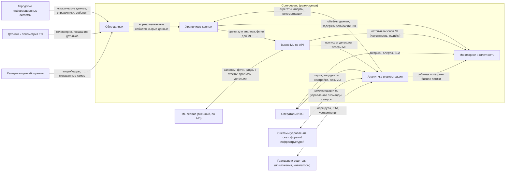
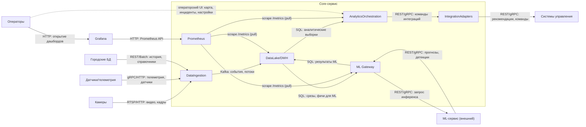

### Лабораторная работа №1
**Тема**: Разработка архитектуры и алгоритма развертывания и мониторинга интеллектуальной транспортной системы

**ФИО**: Попов Александр Иванович
**Группа**: БВТ2203

**Архитектурное решение по ролям сервисов:**
- **Core-сервис** — ключевой сервис, который **реализуется в рамках проекта**. Он принимает данные ИТС (телеметрия, инфраструктура, камеры), хранит их, оркестрирует потоки, отдаёт аналитику и управляющие сигналы, предоставляет UI и интеграции с внешними системами.
- **ML-сервис** — **внешний сервис**, который в проекте **не разрабатывается**. Используется исключительно **по API**: Core-сервис отправляет запросы (например, прогноз трафика, детекция по видео) и получает ответы. Внутренняя реализация ML (обучение, реестр моделей, инференс) не затрагивается.

---

### Шаг 1. Выбор темы

Выбранная тема: **разработка архитектуры и алгоритма развертывания и мониторинга интеллектуальной транспортной системы (ИТС)**.

В рамках проекта реализуется **Core-сервис** ИТС — центральный компонент, который:
- **собирает данные** от различных источников: телеметрия транспортных средств, данные дорожной инфраструктуры, видеопотоки с камер, внешние городские информационные системы;
- **передаёт данные на аналитику и ML** путём вызова **внешнего ML-сервиса по API** (прогнозы, детекция инцидентов, распознавание объектов);
- **хранит и агрегирует** данные и результаты, формирует рекомендации и управляющие воздействия (например, адаптивное управление светофорами, подсказки по маршрутам);
- **обеспечивает мониторинг**, интерфейсы для операторов и интеграции с системами управления и сторонними приложениями.

---

### Шаг 2. Формулировка бизнес-задачи и её ML-интерпретация

#### 2.1. Бизнес-проблема, которую решает сервис

**Бизнес-проблема, на которую нацелен Core-сервис**:

- **Разрозненность данных ИТС**: телеметрия, датчики, видео, записи городских систем существуют **обособленно**, в разных форматах, с разной задержкой и без единой **точки правды** для аналитики.
- **Отсутствие единого контура**: трудно **в одном месте** накапливать потоки, **согласовывать их по времени**, хранить историю и выдавать **согласованную картину** ситуации операторам и внешним потребителям (навигаторы, смежные ИС).
- **Слабая наблюдаемость и качество сервиса**: без выделенного мониторинга **неочевидны** задержки данных, потери событий, сбои и деградация вызовов внешнего ML — это подрывает **доверие** к системе и **скорость реакции** персонала.
- **Высокая стоимость «ручной» аналитики**: диспетчерам и аналитикам приходится **вручную** собирать и сводить сведения из разных источников, если нет **единой платформы** доступа и отчётности.

**Цель сервиса (бизнес-формулировка):** построить **надёжную платформу данных и аналитики ИТС**, которая обеспечивает **своевременную поставку** данных и результатов анализа (включая вызовы внешнего ML), **прозрачный мониторинг** работы контура и **поддержку решений** городских служб и операторов **на основе данных** — без приравнивания этой цели к прямому управлению дорожной инфраструктурой или к гарантированному изменению макропоказателей трафика.

#### 2.2. Выгода и стейкхолдеры

- **Городская администрация / органы власти**:  
  - снижение числа ДТП;  
  - улучшение транспортной доступности районов;  
  - возможность принимать решения на основе данных (data-driven).

- **Операторы ИТС и диспетчерские службы**:  
  - единый интерфейс мониторинга трафика и инцидентов в реальном времени;  
  - автоматические оповещения и подсказки по управлению светофорными циклами и маршрутами;  
  - сокращение времени на ручной анализ данных.

- **Жители и водители**:  
  - уменьшение времени в пути;  
  - повышение безопасности;  
  - более предсказуемое движение, снижение стрессовой нагрузки.

#### 2.3. Зачем тут машинное обучение и какова его функция

Функции машинного обучения выполняет **внешний ML-сервис**; Core-сервис обращается к нему по API и использует результаты. ML используется для:
- **Прогнозирования трафика** - скорость потока, плотность, вероятность затора.
- **Обнаружения инцидентов и нарушений**:
  - автоматическая детекция ДТП по телеметрии и видеопотокам;
  - распознавание нарушений ПДД.
- **Аналитики видеопотоков**:
  - детекция и классификация транспортных средств и пешеходов;
  - оценка загруженности перекрёстков;
  - построение тепловых карт движения.
- **Рекомендаций по управлению инфраструктурой**:
  - адаптивное управление светофорными циклами;
  - рекомендации по перекрытию/открытию полос, изменению ограничений скорости.

#### 2.4. Входные и выходные данные системы

**Входные данные**:
- **Телеметрия транспортных средств**:
  - временные ряды (время, координаты, скорость, ускорение, направление, состояние тормозов и т.п.);
  - формат gRPC.
- **Инфраструктурные данные**:
  - показания дорожных датчиков (индукционные петли, датчики загруженности, метеодатчики);
  - статическая информация о дорожной сети (карта, типы дорог, светофорные объекты).
- **Видеопотоки с камер наблюдения**:
  - потоковое видео (RTSP/RTMP) или последовательности кадров;
  - метаданные о расположении камер.
- **Исторические данные из городских БД**:
  - архивы ДТП, нарушения ПДД, отчёты дорожных служб;
  - исторические ряды трафика.

**Выходные данные**:
- **Прогнозы трафика** для участков дорожной сети:
  - прогноз средней скорости, плотности, вероятности затора;
- **События и алерты**:
  - обнаруженные инциденты (ДТП, остановившийся автомобиль, аварийная ситуация);
  - нарушения ПДД, требующие реакции.
- **Рекомендации по управлению**:
  - предложения по настройке светофорных фаз;
  - рекомендации для диспетчеров по перенаправлению потоков.
- **Аналитические отчёты и дашборды**:
  - агрегированная статистика по времени в пути, задержкам, аварийности;
  - исторический анализ эффективности принятых мер.

---

### Шаг 3. Определение метрик качества

#### 3.1. Бизнес-метрики

Основные бизнес-метрики:

- **Доступность сервиса (SLA)** — доля времени, в течение которого Core-сервис и критичные API (приём данных, выдача аналитики, вызовы ML Gateway) доступны в пределах целевых порогов по задержке и коду ответа.
- **Своевременность данных (data latency)** — типичная и перцентильная задержка между фактом на источнике (измерение датчика, событие телеметрии, кадр с камеры) и моментом, когда агрегат или событие доступны в хранилище/аналитике для потребителей.
- **Полнота покрытия** — доля сегментов дорожной сети, перекрёстков или объектов мониторинга, по которым в заданный момент есть **неустаревшие** данные (в пределах согласованного окна актуальности).
- **Надёжность конвейера данных** — доля успешно принятых и обработанных событий/пакетов без потери и без критических ошибок; доля неуспешных вызовов внешнего ML API при нормальной нагрузке.
- **Операционная реакция на инциденты** — время от момента, когда инцидент **зафиксирован в системе** (после ML/правил), до отображения критического статуса/алерта оператору в привычном канале (панель, Grafana); при наличии журналирования — доля инцидентов, подтверждённых оператором в целевой срок.

Влияние качества ML-моделей (через внешний ML-сервис) на эти бизнес-метрики:
- **Прогнозирование трафика (MAE/RMSE/MAPE)** влияет на **доверие к отображаемым прогнозам** и на решения, принимаемые **на основе** данных Core, но не задаёт напрямую изменение потока на дороге.
- **Детекция инцидентов и объектов (Precision/Recall/F1/mAP)** влияет на **число ложных и пропущенных тревог**, на **загрузку операторов** и на **своевременность** попадания события в операционный контур.
- Сбои или деградация ML **косвенно** ухудшают **надёжность конвейера** и **своевременность** выдачи результатов, если не компенсируются повторными попытками и очередями.

#### 3.2. ML-метрики: что означает каждая метрика

**Метрики регрессии (прогнозирование трафика — скорость, плотность, поток)**

| Метрика | Формула (идея) |
|--------|----------------|
| **MAE** (Mean Absolute Error) | Среднее по выборке от \|предсказание − факт\| |
| **RMSE** (Root Mean Squared Error) | Корень из среднего квадрата ошибок |
| **MAPE** (Mean Absolute Percentage Error) | Среднее от \|ошибка / факт\| × 100% |

**Метрики классификации и детекции (инциденты, нарушения, объекты на видео)**

| Метрика | Определение |
|--------|-------------|
| **Precision** (точность) | TP / (TP + FP) |
| **Recall** (полнота) | TP / (TP + FN) |
| **F1** | 2 × (Precision × Recall) / (Precision + Recall) |
| **mAP** (mean Average Precision) | Усреднение Average Precision по классам и порогам IoU |

Пояснение метрик

- **MAE**: средний промах модели в тех же единицах, что и целевая переменная (например, в среднем ошибка по скорости 5 км/ч).
- **RMSE**: как MAE, но сильнее наказывает большие ошибки (несколько крупных промахов сильно увеличат RMSE).
- **MAPE**: средняя ошибка в процентах (например, 10% означает, что в среднем модель ошибается на 10% от реального значения).
- **Precision**: из всех срабатываний модели, какая доля оказалась верной (например, 90 верных тревог из 100 → precision = 0.9).
- **Recall**: из всех реальных событий, сколько нашла модель (например, нашла 80 ДТП из 100 реальных → recall = 0.8).
- **F1**: одна цифра, которая одновременно учитывает precision и recall; высокая показывает, что и пропусков мало, и ложных тревог немного.
- **mAP**: показывает, насколько хорошо модель в среднем находит и обводит объекты на изображении/видео; чем больше, тем точнее детекция и границы.

TP — истинно положительные, FP — ложно положительные, FN — ложно отрицательные; IoU — пересечение предсказанной и истинной областей объекта.

#### 3.3. Связь ML-метрик с бизнес-метриками

- **Прогнозирование трафика**: малые **MAE/RMSE/MAPE** означают более точные прогнозы как **продукт данных** для навигаторов и диспетчеров; это поддерживает **доверие к сервису** и качество решений **на основе** данных, без утверждения прямого эффекта на среднее время в пути по всему городу.
- **Детекция инцидентов и объектов**: высокий **Recall** снижает риск **пропуска** события в контуре Core; высокий **Precision** снижает **ложную нагрузку** на операторов и шум в алертах; **mAP** характеризует качество видеоаналитики как входа в **операционную реакцию** и **своевременность** отображения ситуации.

---

### Шаг 4. Источник данных и EDA

#### 4.1. Источники данных

Потенциальные источники:
- **Открытые датасеты по трафику и временным рядам**:
  - данные по скорости и плотности трафика на дорогах (например, наборы данных городских транспортных департаментов, данные измерений с детекторов движения);
  - исторические данные по загруженности перекрёстков.
- **Открытые датасеты по видеоаналитике транспорта**:
  - наборы для детекции и трекинга транспортных средств и пешеходов на городских улицах.
- **Синтетически сгенерированные данные**:
  - модельные данные телеметрии транспортных средств и датчиков, сгенерированные при помощи симуляторов (например, симуляторы дорожного движения).

#### 4.2. Структура и особенности данных

**Табличные и временные ряды**:
- данные приходят с разной частотой (от 1 секунды до нескольких минут);
- возможны **пропуски** (отказ датчика, проблемы связи), **аномальные значения** (негативная скорость, резкие скачки).

**Видеоданные**:
- последовательность кадров или видеопоток:
  - разрешение (например, 720p/1080p);
  - частота кадров (обычно 15–30 fps);
- данные тяжёлые по объёму, требуют специальной инфраструктуры для хранения и обработки.

**Событийные данные**:
- записи о ДТП, нарушениях ПДД, ручной разметке операторов;
- часто разрежены по времени, могут быть смещены относительно реального момента происшествия.

Основные проблемы качества:
- пропуски и шум в показаниях датчиков;
- дисбаланс классов (инциденты редки относительно нормального состояния);
- различная частота и формат данных из разных источников;
- необходимость синхронизации по времени и по геопозиции.

#### 4.3. Разведочный анализ данных (EDA) – план и ключевые выводы

При EDA целесообразно:
- **анализировать распределения** скорости, потока, плотности по времени суток, дням недели, сезонам;
- строить **тепловые карты загруженности** по сегментам дорог и времени;
- исследовать **корреляции** между погодными условиями, событиями (ремонт, праздники) и загруженностью;
- выявлять и анализировать **аномалии** (резкие падения скорости, всплески плотности) и сопоставлять их с зарегистрированными инцидентами;
- по видеоданным — оценить качество разметки, распределение классов объектов (легковые, грузовые, автобусы, пешеходы).

Ожидаемые предварительные выводы:
- наличие выраженных **пиковых периодов** (утро/вечер, рабочие/выходные);
- неоднородность загруженности по районам;
- зависимость возникновения заторов от погодных условий и инцидентов;
- редкость происшествий по сравнению с нормальным движением → требуется учитывать дисбаланс при обучении моделей.

---

### Шаг 5. Проектирование высокоуровневой архитектуры системы

В центре архитектуры — **Core-сервис** (реализуется в проекте). **ML-сервис** — внешняя система, взаимодействие только по API.

#### 5.1. Контекстная диаграмма

Объяснение:
- **В центре** — Core-сервис: приём данных, хранилище, вызов ML по API, аналитика, мониторинг, выдача рекомендаций.
- **Внешние акторы**: операторы ИТС (через аналитику — операционный UI; через мониторинг — метрики и алерты), системы управления дорожной инфраструктурой, граждане (через приложения/навигаторы).
- **Внешние системы**: источники данных (камеры, датчики, городские БД) и **ML-сервис** — чёрный ящик, доступный только по API.
- **Потоки по стрелкам**: с камер и датчиков в Core попадают **сырые и нормализованные данные**; в хранилище — **события и результаты обработки**; в ML уходит **подготовленный запрос**, обратно — **прогнозы и детекции**; аналитика формирует **рекомендации для инфраструктуры и граждан**; мониторинг получает **метрики от аналитики, ML Gateway и хранилища** и отдаёт операторам **алерты и сводки по здоровью системы**.

#### 5.2. Основные потоки данных

- **Взаимодействие пользователя с системой**:
  - операторы работают с **Core-сервисом** (веб-интерфейс/панель мониторинга);
  - просматривают карту трафика, инциденты, рекомендации;
  - задают сценарии управления (ручной/автоматический режим), пороги алертов и т.п.

- **Откуда поступают данные для аналитики и инференса**:
  - **В Core-сервис**: телеметрия, показания датчиков, видеопотоки/кадры, данные из городских БД — через приём (Data Ingestion); данные сохраняются в хранилище Core-сервиса.
  - **В ML-сервис**: Core-сервис **отправляет по API** запросы с подготовленными данными (например, срезы телеметрии для прогноза, кадры/метаданные для детекции). Обучение и внутренние пайплайны ML-сервиса в рамках проекта не рассматриваются.

- **Куда сохраняются результаты**:
  - ответы ML по API принимает **Core-сервис** и сохраняет в своё аналитическое хранилище (DWH/OLAP);
  - агрегаты, события, алерты и рекомендации пишутся в хранилище Core-сервиса;
  - отчётность, дашборды и интеграции (светофоры, приложения) получают данные из Core-сервиса.

---

### Шаг 6. Выделение основных модулей и протоколов взаимодействия

Ниже описаны **модули Core-сервиса** (реализуются в проекте). ML-сервис выступает внешней системой и в разбиении на модули не детализируется — взаимодействие с ним идёт только через API.

#### 6.1. Основные модули Core-сервиса и их ответственность

- **Data Ingestion Service**:
  - приём данных из внешних источников (камеры, датчики, телеметрия ТС, городские БД);
  - нормализация форматов, обогащение метаданными;
  - передача подготовленных данных в хранилище Core-сервиса.

- **Data Lake / DWH (хранилище Core-сервиса)**:
  - хранение сырых и подготовленных данных, результатов вызовов ML-сервиса, агрегатов и событий;
  - поддержка аналитических запросов и отчётности; при необходимости те же данные могут быть источником панелей в **Grafana** (например, через datasource к ClickHouse).

- **ML Gateway (клиент ML API)**:
  - подготовка запросов к внешнему ML-сервису (прогноз трафика, детекция инцидентов, распознавание объектов и т.д.);
  - вызов API ML-сервиса, обработка ответов, повторные попытки и обработка ошибок;
  - сохранение результатов в хранилище Core-сервиса и передача в модуль аналитики/оркестрации.

- **Analytics & Orchestration**:
  - бизнес-логика: формирование рекомендаций по управлению светофорами и маршрутам на основе данных из хранилища и ответов ML;
  - оркестрация потоков (когда вызывать ML, какие данные отдавать во внешние системы);
  - агрегация и подготовка данных для **операторского API** (карта, инциденты, настройки) и для интеграций; отдельного модуля «UI дашбордов» в Core нет.

- **Prometheus** (наблюдаемость Core в контуре развёртывания):
  - **периодический scrape** (`pull`) эндпоинтов **`/metrics`** у сервисов Core (Analytics, ML Gateway, Data Lake и при необходимости других компонентов) в формате **Prometheus**;
  - хранение временных рядов, **recording/alerting rules**; доставка алертов через **Alertmanager** (или аналог) в привычные каналы;
  - **Grafana** запрашивает данные у **Prometheus** по **HTTP (Prometheus API)** — дашборды и графики строит **Grafana**, не сам Prometheus.

- **Integration Adapters**:
  - выходные интеграции с системами управления светофорами/дорожной инфраструктурой и с приложениями для граждан (маршрутизация, уведомления);
  - унификация протоколов и форматов обмена (REST, gRPC и т.д.).

#### 6.2. Диаграмма модулей Core-сервиса и взаимодействий

- **Внешние источники → DataIngestion**  
  - **RTSP / HTTP**: поток или кадры с камер.  
  - **gRPC / HTTP**: телеметрия и показания датчиков (структурированные сообщения).  
  - **REST / batch-файлы**: выгрузки из городских систем (история, справочники).

- **DataIngestion → DataLake**  
  - **Kafka**: не «SQL», а **очередь событий** — каждое сообщение описывает факт (проезд, измерение, ссылка на объект в S3 и т.д.).

- **DataLake ↔ ML Gateway**  
  - К хранилищу обращаются **SQL-запросами**, но по сети это **HTTP(S) или нативный протокол ClickHouse**.  
  - В ML уходят **срезы и признаки**; обратно пишутся **результаты инференса** (табличные строки / JSON).

- **ML Gateway ↔ ML-сервис**  
  - **REST (JSON)** или **gRPC (Protobuf)**: запрос «сделай прогноз/детекцию по этим входным данным»; ответ — **числа прогноза, рамки объектов, флаги инцидентов**.

- **Analytics → Adapters**  
  - **REST/gRPC** к адаптерам — **команды и рекомендации** для дорожных систем.

- **Prometheus и Grafana**  
  - Сервисы **Analytics**, **ML Gateway**, **Data Lake** экспонируют **HTTP `/metrics`** в формате **Prometheus**; **Prometheus** **периодически скрейпит** (`pull`) эти эндпоинты (на схеме — отдельная стрелка на каждый целевой сервис).  
  - **Grafana** запрашивает данные у **Prometheus** по **HTTP (Prometheus API)** и строит дашборды; алерты — по правилам **Prometheus** и **Alertmanager** (или аналог).  
  - На **контекстной диаграмме (§5.1)** наблюдаемость показана обобщённо как **«Мониторинг и отчётность»**; здесь — конкретизация: **Prometheus** как компонент стека в контуре Core.

- **Операторы на этой диаграмме**  
  - **Сплошная стрелка** — **Grafana** (открытие тех. дашбордов по **HTTP**). **Пунктир** — операционный доступ к **карте, инцидентам, настройкам** через **API Analytics** (отдельного блока «UI» в Core нет; на схеме показано **упрощённо**, чтобы не смешивать с цепочкой метрик).

---

### Шаг 7. Предварительный выбор технологий и обоснование

Ниже приведён предполагаемый **стек технологий для Core-сервиса** (реализуемого в проекте). Стек внешнего ML-сервиса не задаётся — взаимодействие с ним только по API.

#### 7.1. Data Ingestion и стриминг (Core-сервис)

- **Kafka / Apache Kafka**:
  - высоконагруженный стриминг телеметрии и событий от датчиков и камер;
  - горизонтальное масштабирование, репликация, хранение истории; развитая экосистема коннекторов.

Выбор: **Kafka** как основной брокер стриминга для Core-сервиса.

#### 7.2. Хранилище данных (Core-сервис)

- **Объектное хранилище (S3-совместимое)** для сырых данных и видеоконтента:
  - масштабируемое хранение больших объёмов, долговременное хранение.
- **Колоночная СУБД (ClickHouse)** для аналитических запросов, агрегатов и результатов вызовов ML:
  - высокая производительность на временных рядах и событиях.
- При необходимости **PostgreSQL** для метаданных, конфигурации и транзакционных сценариев.

Выбор: **S3 + ClickHouse**; PostgreSQL — для метаданных и конфигурации.

#### 7.3. ML Gateway и API-слой (Core-сервис)

- **Core-сервис на Go**:
  - основной сервис и его API-слой реализуются на **Golang** (например, с использованием стандартной библиотеки `net/http` или фреймворка вроде `chi` / `gorilla/mux` / `echo`);
  - внутри Core реализован HTTP/gRPC-клиент для вызова внешнего ML-сервиса.
- **Взаимодействие с ML-сервисом**:
  - повторные попытки, таймауты, логирование запросов/ответов для отладки и мониторинга;
  - поддержка REST и/или gRPC в зависимости от контракта ML-сервиса.

Выбор: **Golang** как основной язык Core-сервиса; вызовы ML — через встроенный HTTP/gRPC-клиент (REST или gRPC по контракту ML-сервиса).

#### 7.4. Аналитика и оркестрация (Core-сервис)

- **Ядро логики** на Go: агрегация данных из хранилища, формирование рекомендаций, решение о том, когда и какие запросы отправлять в ML-сервис.
- **Планировщики/воркеры** для периодических задач (агрегация, вызов ML по расписанию): встроенные планировщики/воркеры на Go (goroutines, cron-like решения).

#### 7.5. Оркестрация и развертывание (Core-сервис)

- **Kubernetes** — оркестрация контейнеризированного Core-сервиса, масштабирование, отказоустойчивость.
- **Helm** — управление манифестами и конфигурациями.

#### 7.6. Мониторинг и логирование (Core-сервис)

- **Prometheus + Grafana** — метрики инфраструктуры и приложения (в т.ч. задержки и доступность вызовов ML API).
- **ELK / OpenSearch** — централизованные логи сервисов Core.
- Алерты при недоступности ML-сервиса или росте ошибок/задержек API.

Стек внешнего ML-сервиса (обучение, реестр моделей, инференс) в проекте не выбирается и не обосновывается — используется только его API.

---

### Ссылки на источники

- **Примеры открытых датасетов по трафику и ИТС**:
  - [Открытые транспортные данные городов (пример)](https://opentransportdata.swiss/en/)  
  - [Пример датасета по трафику и дорожным событиям](https://archive.ics.uci.edu/)
- **Примеры датасетов по видеоаналитике транспорта**:
  - [Traffic Object Detection (HF)](https://huggingface.co/datasets/AITC-Traffic-Density/Traffic-Object-Detection)
  - [Road Traffic (HF)](https://huggingface.co/datasets/Francesco/road-traffic)
  - [UVH-26 – Urban Vehicle Hub (HF)](https://huggingface.co/datasets/iisc-aim/UVH-26)
- **Технологии и стек**:
  - [Apache Kafka Documentation](https://kafka.apache.org/documentation/)  
  - [ClickHouse Documentation](https://clickhouse.com/docs/)  
  - [Kubernetes Documentation](https://kubernetes.io/docs/)  
  - [Prometheus Documentation](https://prometheus.io/docs/introduction/overview/)  
  - [Grafana Documentation](https://grafana.com/docs/)  
