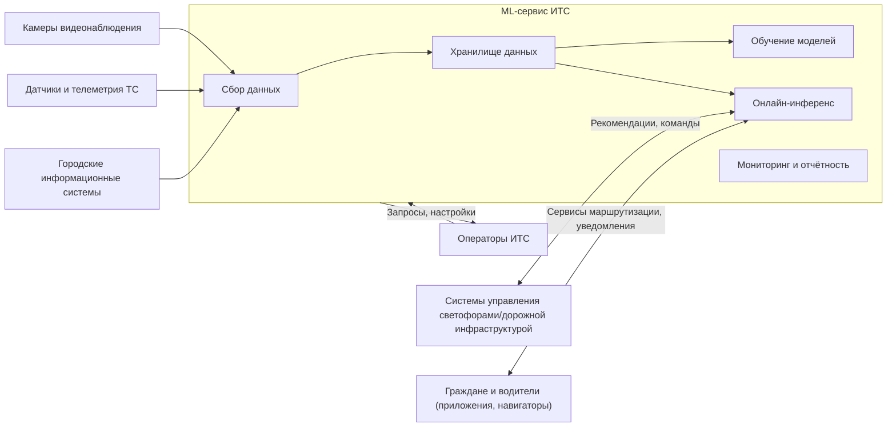
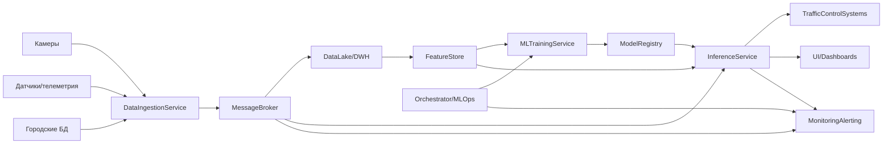

### Лабораторная работа №1
**Тема**: Разработка архитектуры и алгоритма развертывания и мониторинга интеллектуальной транспортной системы

**ФИО**: Попов Александр Иванович
**Группа**: БВТ2203

---

### Шаг 1. Выбор темы

Выбранная тема: **разработка архитектуры и алгоритма развертывания и мониторинга интеллектуальной транспортной системы (ИТС)**.

Интеллектуальная транспортная система рассматривается как комплексный программно-аппаратный комплекс, который:
- **собирает данные** от различных источников: телеметрия транспортных средств, данные дорожной инфраструктуры, видеопотоки с камер, внешние городские информационные системы;
- **обрабатывает и анализирует** данные с использованием методов машинного обучения;
- **формирует рекомендации и управляющие воздействия** (например, адаптивное управление светофорами, подсказки по маршрутам, обнаружение инцидентов);
- **обеспечивает мониторинг состояния системы и моделей**, а также удобные интерфейсы для операторов и интеграции с внешними системами.

---

### Шаг 2. Формулировка бизнес-задачи и её ML-интерпретация

#### 2.1. Бизнес-проблема, которую решает сервис

Основные проблемы городского транспорта:
- **Заторы и перегруженность дорог** в часы пик.
- **Высокий уровень аварийности**.
- **Низкая эффективность управления инфраструктурой**.
- **Отсутствие оперативной аналитики** и удобных инструментов мониторинга для городских служб и операторов ИТС.

Цель сервиса — **оптимизировать проблемные участки дороги, снизить аварийность, повысить эффективность инфраструктуры и качество транспортного обслуживания**, используя интеллектуальный анализ данных и прогнозирование.

#### 2.2. Выгода и стейкхолдеры

- **Городская администрация / органы власти**:  
  - снижение числа ДТП;  
  - улучшение транспортной доступности районов;  
  - возможность принимать решения на основе данных (data-driven).

- **Операторы ИТС и диспетчерские службы**:  
  - единый интерфейс мониторинга трафика и инцидентов в реальном времени;  
  - автоматические оповещения и подсказки по управлению светофорными циклами и маршрутами;  
  - сокращение времени на ручной анализ данных.

- **Жители и водители**:  
  - уменьшение времени в пути;  
  - повышение безопасности;  
  - более предсказуемое движение, снижение стрессовой нагрузки.

#### 2.3. Зачем тут машинное обучение и какова его функция

Машинное обучение используется для:
- **Прогнозирования трафика** - скорость потока, плотность, вероятность затора.
- **Обнаружения инцидентов и нарушений**:
  - автоматическая детекция ДТП по телеметрии и видеопотокам;
  - распознавание нарушений ПДД.
- **Аналитики видеопотоков**:
  - детекция и классификация транспортных средств и пешеходов;
  - оценка загруженности перекрёстков;
  - построение тепловых карт движения.
- **Рекомендаций по управлению инфраструктурой**:
  - адаптивное управление светофорными циклами;
  - рекомендации по перекрытию/открытию полос, изменению ограничений скорости.

#### 2.4. Входные и выходные данные системы

**Входные данные**:
- **Телеметрия транспортных средств**:
  - временные ряды (время, координаты, скорость, ускорение, направление, состояние тормозов и т.п.);
  - формат gRPC.
- **Инфраструктурные данные**:
  - показания дорожных датчиков (индукционные петли, датчики загруженности, метеодатчики);
  - статическая информация о дорожной сети (карта, типы дорог, светофорные объекты).
- **Видеопотоки с камер наблюдения**:
  - потоковое видео (RTSP/RTMP) или последовательности кадров;
  - метаданные о расположении камер.
- **Исторические данные из городских БД**:
  - архивы ДТП, нарушения ПДД, отчёты дорожных служб;
  - исторические ряды трафика.

**Выходные данные**:
- **Прогнозы трафика** для участков дорожной сети:
  - прогноз средней скорости, плотности, вероятности затора;
- **События и алерты**:
  - обнаруженные инциденты (ДТП, остановившийся автомобиль, аварийная ситуация);
  - нарушения ПДД, требующие реакции.
- **Рекомендации по управлению**:
  - предложения по настройке светофорных фаз;
  - рекомендации для диспетчеров по перенаправлению потоков.
- **Аналитические отчёты и дашборды**:
  - агрегированная статистика по времени в пути, задержкам, аварийности;
  - исторический анализ эффективности принятых мер.

---

### Шаг 3. Определение метрик качества

#### 3.1. Бизнес-метрики

Основные бизнес-метрики:
- **Среднее время в пути** на ключевых маршрутах города.
- **Средняя задержка** на перекрёстках и участках с высокой нагрузкой.
- **Количество ДТП и инцидентов** на единицу времени и на 1 000 транспортных средств.
- **Количество серьёзных нарушений ПДД**, автоматически выявленных системой.
- **Экономический эффект**:
  - оценка сэкономленного времени водителей и пассажиров;
  - оценка снижения расхода топлива/выбросов CO₂.

Влияние качества ML-моделей на бизнес-метрики:
- **Точность прогнозов трафика** напрямую влияет на качество управления светофорами и маршрутизацией → сокращение времени в пути и задержек.
- **Качество детекции инцидентов** позволяет оперативно реагировать на аварии → снижение времени блокировки участков, повышение безопасности.
- **Надёжность распознавания нарушений** влияет на доверие к системе и эффективность автоматического контроля.

#### 3.2. ML-метрики и их связь с бизнес-метриками

Для разных подзадач выбираются разные ML-метрики.

- **Прогнозирование трафика (регрессия, временные ряды)**:
  - `MAE` (Mean Absolute Error) — средняя абсолютная ошибка предсказаний скорости/плотности;
  - `RMSE` (Root Mean Squared Error) — штрафует большие ошибки, важен для обнаружения резких аномалий;
  - `MAPE` (Mean Absolute Percentage Error) — удобно интерпретировать как относительную ошибку в процентах.

  Связь с бизнесом:
  - малые значения MAE/RMSE/MAPE означают, что система точно предсказывает трафик → можно заранее перенастроить светофоры и маршруты, снижая задержки и заторы.

- **Детекция инцидентов и нарушений (классификация/детекция)**:
  - `Precision` (точность) — доля истинных инцидентов среди детектированных системой;
  - `Recall` (полнота) — доля найденных системой инцидентов среди всех фактических;
  - `F1` — гармоническое среднее precision и recall;
  - для детекции на изображениях/видео — `mAP` (mean Average Precision) при различных порогах IoU.

  Связь с бизнесом:
  - высокий recall важен для **минимизации пропущенных инцидентов**;
  - достаточный precision важен для **снижения ложных тревог**, чтобы операторы не игнорировали уведомления;
  - mAP и связанные метрики позволяют оценить качество распознавания объектов на видео, что критично для корректной аналитики загруженности и нарушений.

---

### Шаг 4. Источник данных и EDA

#### 4.1. Источники данных

Потенциальные источники:
- **Открытые датасеты по трафику и временным рядам**:
  - данные по скорости и плотности трафика на дорогах (например, наборы данных городских транспортных департаментов, данные измерений с детекторов движения);
  - исторические данные по загруженности перекрёстков.
- **Открытые датасеты по видеоаналитике транспорта**:
  - наборы для детекции и трекинга транспортных средств и пешеходов на городских улицах.
- **Синтетически сгенерированные данные**:
  - модельные данные телеметрии транспортных средств и датчиков, сгенерированные при помощи симуляторов (например, симуляторы дорожного движения).

#### 4.2. Структура и особенности данных

**Табличные и временные ряды**:
- поля: `timestamp`, `sensor_id`, `road_segment_id`, `speed`, `flow`, `occupancy`, `temperature`, `precipitation`, и др.;
- данные приходят с разной частотой (от 1 секунды до нескольких минут);
- возможны **пропуски** (отказ датчика, проблемы связи), **аномальные значения** (негативная скорость, резкие скачки).

**Видеоданные**:
- последовательность кадров или видеопоток:
  - разрешение (например, 720p/1080p);
  - частота кадров (обычно 15–30 fps);
- данные тяжёлые по объёму, требуют специальной инфраструктуры для хранения и обработки.

**Событийные данные**:
- записи о ДТП, нарушениях ПДД, ручной разметке операторов;
- часто разрежены по времени, могут быть смещены относительно реального момента происшествия.

Основные проблемы качества:
- пропуски и шум в показаниях датчиков;
- дисбаланс классов (инциденты редки относительно нормального состояния);
- различная частота и формат данных из разных источников;
- необходимость синхронизации по времени и по геопозиции.

#### 4.3. Разведочный анализ данных (EDA) – план и ключевые выводы

При EDA целесообразно:
- **анализировать распределения** скорости, потока, плотности по времени суток, дням недели, сезонам;
- строить **тепловые карты загруженности** по сегментам дорог и времени;
- исследовать **корреляции** между погодными условиями, событиями (ремонт, праздники) и загруженностью;
- выявлять и анализировать **аномалии** (резкие падения скорости, всплески плотности) и сопоставлять их с зарегистрированными инцидентами;
- по видеоданным — оценить качество разметки, распределение классов объектов (легковые, грузовые, автобусы, пешеходы).

Ожидаемые предварительные выводы:
- наличие выраженных **пиковых периодов** (утро/вечер, рабочие/выходные);
- неоднородность загруженности по районам;
- зависимость возникновения заторов от погодных условий и инцидентов;
- редкость происшествий по сравнению с нормальным движением → требуется учитывать дисбаланс при обучении моделей.

---

### Шаг 5. Проектирование высокоуровневой архитектуры системы

#### 5.1. Контекстная диаграмма

Ниже приведена контекстная диаграмма системы (mermaid).

Объяснение:
- система ИТС ML-сервис находится в центре и взаимодействует с **внешними источниками данных** (камеры, датчики, городские БД) и **потребителями результатов** (операторы, системы управления, граждане через приложения);
- внутри выделяются основные логические блоки: сбор данных, хранилище, обучение, инференс, мониторинг.

#### 5.2. Основные потоки данных

- **Взаимодействие пользователя с системой**:
  - операторы ИТС заходят в веб-интерфейс/панель мониторинга;
  - просматривают текущую карту трафика, инциденты, рекомендации;
  - могут изменять параметры работы моделей (порог срабатывания, режимы) и задавать сценарии управления (ручной/автоматический режим).

- **Потоки данных для обучения**:
  - сырые данные (телеметрия, показания датчиков, видео) поступают в слой `Data Ingestion` через брокер сообщений/стриминг-платформу;
  - данные сохраняются в **даталейк/хранилище** (объектное или колонночное);
  - периодически запускаются пайплайны подготовки фич (очистка, агрегация, генерация признаков) и выгрузки обучающих выборок;
  - обученные модели и артефакты сохраняются в **реестре моделей**.

- **Потоки данных для инференса**:
  - онлайн-потоки телеметрии и видеоданные поступают в сервис инференса;
  - сервис инференса применяет последнюю одобренную модель к поступающим данным;
  - результаты (прогнозы, детекции) отправляются:
    - в интерфейс операторов и дашборды;
    - в внешние системы управления (например, для автоматического регулирования светофоров);
    - в систему логирования/мониторинга для последующего анализа и оценки качества моделей.

- **Сохранение результатов**:
  - агрегированные результаты и события пишутся в **аналитическое хранилище** (DWH/OLAP-БД);
  - доступ к ним получают отчётность, BI-инструменты и панели мониторинга.

---

### Шаг 6. Выделение основных модулей и протоколов взаимодействия

#### 6.1. Основные модули и их ответственность

- **Data Ingestion Service**:
  - приём данных из внешних источников (камеры, датчики, городские БД);
  - нормализация форматов, обогащение метаданными;
  - публикация сырых событий в брокер сообщений и/или запись в сырое хранилище.

- **Data Lake / DWH**:
  - долговременное хранение сырых и подготовленных данных;
  - поддержка аналитических запросов и построения обучающих выборок.

- **Feature Store**:
  - хранение и переиспользование вычисленных признаков (фич) для обучения и инференса;
  - обеспечение консистентности фич онлайн/офлайн.

- **ML Training Service**:
  - запуск пайплайнов обучения моделей (пакетная обработка);
  - выбор и настройка алгоритмов, кросс-валидация, подбор гиперпараметров;
  - логирование экспериментов.

- **Model Registry**:
  - хранение версий обученных моделей и метаданных (метрики, дата обучения, параметры);
  - управление жизненным циклом моделей (staging, production, archived).

- **Inference Service (Online/Batch)**:
  - онлайн-инференс (real-time/near real-time) для телеметрии и видео;
  - пакетный инференс для аналитических задач;
  - масштабирование под нагрузку.

- **Monitoring & Alerting**:
  - мониторинг инфраструктурных метрик (CPU, память, задержки);
  - мониторинг метрик качества моделей (data drift, prediction drift, метрики пост-фактум);
  - генерация алертов для операторов и инженеров.

- **Orchestrator / MLOps-платформа**:
  - управление пайплайнами (обучение, деплой, обновление моделей);
  - интеграция с CI/CD;
  - планирование регулярного переобучения.

- **User Interface / Dashboards**:
  - визуализация карты трафика, инцидентов, метрик;
  - управление конфигурацией системы и режимами работы моделей.

#### 6.2. Диаграмма модулей и взаимодействий

Протоколы взаимодействия:
- между внешними источниками и `Data Ingestion Service` — **HTTP/REST, gRPC, потоковые протоколы** (например, RTSP для видео) + брокер сообщений;
- между сервисами внутри системы:
  - **Message Broker** (например, Kafka/RabbitMQ) для стриминга событий;
  - **REST/gRPC-API** между `Inference Service`, UI и внешними системами управления;
  - **Batch-загрузки** (паркет/CSV/ORC) между `Data Lake` и пайплайнами обучения;
  - **специализированный API** для `Model Registry` и `Feature Store`.

---

### Шаг 7. Предварительный выбор технологий и обоснование

#### 7.1. Data Ingestion и стриминг

- **Kafka / Apache Kafka**:
  - хорошо подходит для высоконагруженного стриминга телеметрии и событий;
  - поддерживает горизонтальное масштабирование, репликацию, хранение истории;
  - развитая экосистема коннекторов.
- Альтернатива: **RabbitMQ** — проще в настройке, но хуже масштабируется для очень больших потоков телеметрии; ориентирован скорее на очереди задач, чем на долговременное хранение потоков.

Выбор: **Kafka** как основной брокер стриминга.

#### 7.2. Хранилище данных

- **Объектное хранилище (S3-совместимое)** для сырых данных и видеоконтента:
  - дешёвое и масштабируемое хранение больших объёмов;
  - удобно для долговременного хранения и оффлайн-аналитики.
- **Колонночная СУБД (ClickHouse)** для аналитических запросов и агрегаций:
  - высокая производительность на больших объёмах временных рядов и событий;
  - поддержка сложных аналитических запросов.
- Альтернатива: **PostgreSQL** — отлично подходит для транзакционных и смешанных нагрузок, но хуже масштабируется на объёмах видео и очень больших логов.

Выбор: **S3-хранилище + ClickHouse** в качестве основного аналитического хранилища, возможное использование PostgreSQL для метаданных.

#### 7.3. Feature Store

- Варианты: **Feast**, собственная реализация на базе DWH + key-value хранилища.
- Выбор: **Feast** (или аналог) как специализированный feature store:
  - упрощает переиспользование фич между моделями;
  - обеспечивает консистентность онлайн/офлайн;
  - интегрируется с популярными DWH и стриминговыми системами.

#### 7.4. Обучение моделей

- **Python + PyTorch / TensorFlow**:
  - широкий набор библиотек для работы с временными рядами и компьютерным зрением;
  - активное сообщество, большое количество примеров и предобученных моделей.
- Для пайплайнов обучения:
  - **Apache Airflow / Prefect / Kedro** для оркестрации ETL/ML-процессов;
  - выбор в пользу **Airflow** обусловлен зрелой экосистемой и удобством расписания задач.

Альтернативы: фреймворки на других языках (например, Java) менее удобны для быстрой разработки и экспериментов в ML.

#### 7.5. Инференс и API-сервисы

- **FastAPI**:
  - современный, быстрый фреймворк на Python для построения REST/gRPC сервисов;
  - удобная валидация данных и автогенерация документации.
- Для высоконагруженного инференса видео:
  - возможно использование специализированных серверов (TensorRT Inference Server / Triton).

Альтернативы: Flask / Django REST Framework — проверенные решения, но FastAPI даёт лучшую производительность и типизацию «из коробки» для микросервисной архитектуры.

#### 7.6. Оркестрация, развертывание и масштабирование

- **Kubernetes**:
  - стандарт де-факто для оркестрации контейнеризированных сервисов;
  - поддерживает автоматическое масштабирование, отказоустойчивость, декларативное управление.
- **Helm**:
  - управление манифестами и конфигурациями Kubernetes.
- **Argo CD / GitOps-подход**:
  - упрощает управление релизами и конфигурациями через Git.

Альтернатива: развертывание на виртуальных машинах «вручную» или через простые скрипты хуже масштабируется и сложнее поддерживается для большого числа микросервисов.

#### 7.7. Мониторинг и логирование

- **Prometheus + Grafana**:
  - де-факто стандарт для мониторинга метрик инфраструктуры и сервисов;
  - удобные дашборды и алерты.
- **ELK / OpenSearch Stack**:
  - централизованное логирование, поиск по логам сервисов.
- Для мониторинга качества моделей:
  - специализированные инструменты (например, **Evidently AI** или аналогичные библиотеки) для отслеживания data drift и качества.

Альтернативы: собственные решения для мониторинга потребуют значительных усилий по разработке и поддержке.

---

### Ссылки на источники

- **Примеры открытых датасетов по трафику и ИТС**:
  - [Открытые транспортные данные городов (пример)](https://opentransportdata.swiss/en/)  
  - [Пример датасета по трафику и дорожным событиям](https://archive.ics.uci.edu/)
- **Примеры датасетов по видеоаналитике транспорта**:
  - [Пример датасета для детекции транспортных средств](https://ai.stanford.edu/~jkrause/cars/car_dataset.html)
- **Технологии и стек**:
  - [Apache Kafka Documentation](https://kafka.apache.org/documentation/)  
  - [ClickHouse Documentation](https://clickhouse.com/docs/)  
  - [FastAPI Documentation](https://fastapi.tiangolo.com/)  
  - [Kubernetes Documentation](https://kubernetes.io/docs/)  
  - [Prometheus Documentation](https://prometheus.io/docs/introduction/overview/)  
  - [Grafana Documentation](https://grafana.com/docs/)  
  - [Feast Feature Store](https://docs.feast.dev/)  
  - [Apache Airflow Documentation](https://airflow.apache.org/docs/)

