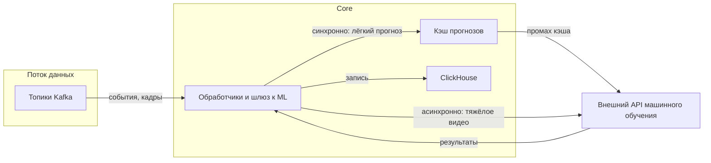

### Лабораторная работа №2
**Тема**: Надёжность и воспроизводимость ML-системы в контуре интеллектуальной транспортной системы (валидация, утечки данных, масштабирование)

**ФИО**: Попов Александр Иванович  
**Группа**: БВТ2203

---

## Шаг 1. Стратегия валидации и воспроизводимость

### 1.1. Стратегия валидации с учётом природы данных

В ИТС данные приходят из разных источников с разной структурой и частотой. Стратегию проверки качества модели нужно выбирать **отдельно по каждому источнику**: одно и то же разбиение выборки по времени подходит для потоковых рядов с датчиков, но не решает задачу корреляции кадров с камер.

| Источник данных | Природа данных | Стратегия валидации | Обоснование |
|-----------------|----------------|---------------------|-------------|
| Телеметрия транспортных средств | Временные ряды координат, скорости и связанных величин; сильная автокорреляция и зависимость от времени суток | Разделение по времени: обучение на более ранних интервалах, контроль качества на более поздних; при необходимости пошаговая проверка с движением окна по временной оси | Случайное перемешивание точек смешивает ранние и поздние наблюдения и завышает метрики относительно режима поступления данных в реальном времени |
| Дорожные датчики и стационарная инфраструктура | Ряды показаний петель, датчиков загруженности, метеоданных; пропуски и разная частота по объектам | То же разделение по времени на уровне объектов или сегментов сети; при проверке обобщения на новые участки — вывод целых сегментов или районов только в контрольную часть | Иначе модель может опираться на пространственные закономерности обучающих участков и переоценить качество на новых |
| Видеопотоки с камер наблюдения | Последовательности кадров; соседние кадры и кадры одной смены сильно похожи | Разделение по записи, смене, идентификатору камеры или суток, а не по отдельным кадрам; при нескольких камерах на одном объекте — по группе камер или перекрёстку | Иначе в обучающей и контрольной частях оказываются почти одинаковые сцены, и метрики на отложенных данных не отражают перенос на новые съёмки |
| Городские информационные системы и архивы событий | Справочники дорожной сети, архивы ДТП и нарушений, исторические ряды трафика; метки событий могут появляться с задержкой | Разделение по времени с учётом момента фиксации записи в источнике; для редких событий — разбиение по группам: идентификатор инцидента или окно вокруг события; контроль по точности, полноте и F1 на отложенном периоде | Сильный дисбаланс классов и риск подмешивания будущей информации из обновлённых записей |

Для отчётности о качестве имеет смысл явно фиксировать, какой сценарий проверки относится к какому источнику и к каким требованиям в эксплуатации.

### 1.2. Воспроизводимость экспериментов: версионирование данных

Воспроизводимость обучения и сравнения прогонов опирается на то, чтобы повторно использовать те же сырые и подготовленные данные. Ниже перечислено, что фиксировать по каждому источнику отдельно.

| Источник данных | Что версионировать |
|-----------------|-------------------|
| Телеметрия транспортных средств | Неизменяемый снимок за согласованный интервал времени: идентификатор выгрузки в хранилище, контентный хэш или префикс бакета; для стриминговой выборки — границы окна по времени и версия правил нормализации из потока в признаки |
| Дорожные датчики и инфраструктура | То же для рядов по каждому типу датчика или топику; при необходимости отдельные снимки по сегментам сети, чтобы воспроизводить обучение прогноза по участкам |
| Видеопотоки с камер | Снимок набора клипов или объектов в объектном хранилище; для потоковой обработки — интервал времени, список камер и версия шага извлечения кадров или окон |
| Городские информационные системы | Версия или дата выгрузки справочников; для архивов событий — снимок на дату среза плюс правила отсечения меток по времени доступности |

Без такой привязки к источникам невозможно гарантировать, что повторный эксперимент использует те же входные данные, что и исходный.

---

## Шаг 2. Анализ утечек данных

Для ИТС утечки возможны в каждом источнике данных, потому что в реальных данных часто есть задержки публикации событий, пересечения фрагментов одной сцены во времени и ошибки в том, как формируются признаки и метки. Для каждого источника ниже перечислены основные риски и меры предотвращения.

| Источник данных | Риск утечки | Как предотвратить |
|---|---|---|
| Телеметрия транспортных средств | 1) Временная утечка в признаках: при расчёте признаков окно включает моменты, которые фактически были неизвестны на времени принятия решения. 2) Пересечение объектов: один и тот же автомобиль или одна и та же траектория попадают и в обучающую, и в контрольную часть, и модель запоминает частные особенности, а не закономерности | 1) Формировать признаки причинно: использовать только данные, доступные к моменту времени t. Окна усреднений и агрегатов строить с явным ограничением по времени так, чтобы данные из будущего не попадали в признаки. 2) Разделять разбиение по идентификаторам треков или автомобилей, а не по отдельным моментам времени |
| Дорожные датчики и инфраструктура | 1) Утечка через подготовку признаков: параметры нормализации и заполнения пропусков посчитаны с использованием данных контрольной части. 2) Утечка через «актуальность» инфраструктуры: справочники и статусы сегментов обновлялись после события, и в обучении используется более свежая версия, чем была бы доступна на момент времени t | 1) Оценивать параметры преобразований только на обучающей части и дальше применять к валидации и тесту. 2) Зафиксировать версию справочников и описание сети на дату среза, а при необходимости использовать правила отсечения по времени доступности инфраструктуры |
| Видеопотоки с камер | 1) Утечка через временной контекст: для метки кадра используются кадры после момента t, хотя в эксплуатации они ещё не доступны. 2) Пересечение фрагментов: один и тот же клип или перекрывающиеся временные окна попадают в разные части разбиения | 1) Определить, какие кадры доступны на момент времени t, и строить признаки и целевые метки так, чтобы использовался только этот доступный контекст. 2) Разделять разбиение по клипам, сменам и идентификаторам камер. Исключать пересечение по времени между частями разбиения |
| Городские информационные системы и архивы событий | 1) Утечка через метки с задержкой: запись о ДТП или нарушении в базе появляется позже, и если в обучении использовать такую метку без границы по времени доступности, контрольная часть получает будущую информацию. 2) Утечка через ретроспективные исправления: метки и атрибуты событий могут быть пересмотрены после события | 1) Для обучения использовать только те метки, которые были бы доступны к моменту времени t с учётом реальной задержки их появления. 2) Фиксировать версию выгрузки архивов и правила среза данных по дате |

Если для конкретного датасета гарантируется, что метки и признаки формируются строго без использования информации из будущего и без пересечений фрагментов между частями разбиения, то риск утечки действительно ниже. Но это нужно явно проверять для каждого источника отдельно, а не предполагать по умолчанию.
---

## Шаг 3. Масштабирование и задержки

### 3.1. Оценка нагрузки и допустимая задержка

Нагрузку нужно оценивать по разным каналам: поток событий в Kafka, вызовы внешнего ML через шлюз, синхронные запросы операторов и интеграций к Core-сервису.

**Допущения для численного примера** (средний городской контур):

| Параметр | Значение | Обоснование |
|----------|-----------|--------------|
| Камеры с видеоаналитикой | 150 | Число камер, для которых в реальном времени нужен инференс |
| Шаг инференса на камеру | 1 окно за 4 с (0,25 в 1 с) | Инференс тяжёлый, поэтому анализируют не каждый кадр, а окна с шагом 4 секунды |
| Сегментов дорожной сети с прогнозом | 600 | Количество участков, для которых нужен регулярный прогноз |
| Период обновления прогноза | 60 с | Прогноз обновляется раз в минуту по расписанию |
| Коэффициент пика по вызовам ML | 1,4 | В часы пик и при инцидентах растёт активность и частота обращений |
| Операторы и интерактивные пользователи в пике | 20 | Одновременные пользователи, обновляющие карту и запросы статусов |
| Среднее число интерактивных обновлений на пользователя | 0,4 запроса в 1 с | Ориентир: в пике пользователь запрашивает обновления в среднем раз в 2,5 с |

**Оценки вызовов и нагрузки (для оценки масштабирования):**

1. **Kafka** (телеметрия, датчики, нормализованные события) — сообщения в потоке могут исчисляться тысячами и десятками тысяч в 1 с; это нельзя напрямую приравнивать к числу запросов к внешнему ML. Для Kafka в основном важно, чтобы потребители успевали: оценивают отставание и достаточность партиций.
2. **Вызовы внешнего ML по видео**:
   - среднее: `150 × 0,25 = 37,5` (≈ 38) запросов в 1 с
   - пик: `37,5 × 1,4 = 52,5` (≈ 53) запросов в 1 с
3. **Прогноз трафика по сегментам**:
   - среднее: `600 / 60 = 10` запросов в 1 с (если один прогноз относится к текущему периоду обновления)
   - пик: `10 × 1,4 = 14` запросов в 1 с
4. **Синхронные запросы операторского контура к Core**:
   - среднее: `20 × 0,4 = 8` запросов в 1 с
   - пик интерактивных обновлений: около `12` запросов в 1 с

**Целевые соглашения по задержке (пример):**

| Сценарий | Целевая задержка | Пояснение |
|----------|------------------|-----------|
| Синхронный прогноз по признакам на короткий горизонт | не более 300 мс для 95% запросов | Интерфейсы операторов и внешние клиенты ждут быстрый ответ |
| Видеоинференс (тяжёлые окна) | 3–6 с для 95% обработанных окон или асинхронная выдача | Допустима очередь, если срочные оповещения не блокируют интерфейс |
| Фоновый пересчёт агрегатов и отчётов | минуты | Вне интерактивного пути пользователя |

При росте нагрузки в первую очередь увеличивается число вызовов внешнего ML (видео и прогнозы) и синхронных обращений интерактивного контура. Это компенсируют квотами на стороне внешнего ML, батчированием, кэшированием и горизонтальным масштабированием обработчиков в Core. Для Kafka важны оценка отставания потребителей и резерв по пропускной способности.

### 3.2. Масштабирование при росте нагрузки

Связка с выбранным стеком (Kubernetes, Kafka, горизонтальное масштабирование сервисов Core):

- **Горизонтальное масштабирование**: несколько реплик шлюза к ML и обработчиков, читающих топики Kafka и вызывающих API машинного обучения; автоматическое увеличение числа подов по загрузке процессора, памяти, длине очереди или пользовательским метрикам с выгрузкой в Prometheus.
- **Синхронный и асинхронный вывод**:
  - лёгкие запросы (прогноз по табличным признакам) — синхронные, с таймаутом и кэшем по ключу сегмент и временной бакет;
  - тяжёлое видео — очередь в Kafka или внутренняя, асинхронная обработка, запись результата в ClickHouse и событие для аналитики; при необходимости обратный вызов по HTTP.
- **Кэширование**: кэш прогнозов с ограниченным временем хранения записи, например 30–60 с, снижает повторные вызовы внешнего ML при одинаковых срезах; устойчивые к повторной отправке ключи запросов.
- **Разделение критичных путей**: отдельные лимиты и очереди для высокоприоритетных оповещений об инцидентах и для фоновой аналитики.
- **Внешний ML-сервис**: масштабирование по соглашению с поставщиком (квоты запросов в 1 с, отдельные конечные точки для вычислений на GPU); при недоступности — снижение качества сервиса с сохранением работоспособности: повтор с нарастающей паузой, использование последнего валидного прогноза, резервные эвристики при наличии мониторинга вызовов и алертов.

Рост нагрузки покрывается разбиением топиков Kafka на разделы, репликами обработчиков и шлюза, кэшем и разделением синхронных и асинхронных путей; ограничение по внешнему ML снимается квотами, пакетной обработкой и при необходимости отдельным масштабированием на стороне поставщика по контракту.

---

### Ссылки на источники (для справки)

- [Apache Kafka Documentation](https://kafka.apache.org/documentation/)
- [Kubernetes Horizontal Pod Autoscaling](https://kubernetes.io/docs/tasks/run-application/horizontal-pod-autoscale/)
- [Prometheus Documentation](https://prometheus.io/docs/introduction/overview/)
