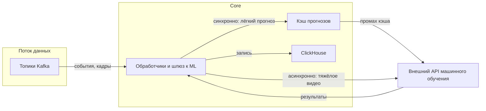

### Лабораторная работа №2
**Тема**: Надёжность и воспроизводимость ML-системы в контуре интеллектуальной транспортной системы (валидация, утечки данных, масштабирование)

**ФИО**: Попов Александр Иванович  
**Группа**: БВТ2203

---

## Шаг 1. Стратегия валидации и воспроизводимость

### 1.1. Стратегия валидации с учётом природы данных

ML-задачи в ИТС (см. лабораторную №1) делятся на прогнозирование трафика по временным рядам, компьютерное зрение по видео и обнаружение редких инцидентов. Для каждой подзадачи способ разделения выборки должен отражать зависимость наблюдений во времени и пространстве, а не предполагать независимые одинаково распределённые точки.

| Подзадача | Природа данных | Рекомендуемая стратегия валидации | Обоснование |
|-----------|----------------|-----------------------------------|-------------|
| Прогноз трафика (скорость, плотность, поток по сегментам сети) | Временные ряды с сильной автокорреляцией и сезонностью (часы, дни недели, праздники) | Разделение по времени: обучение на прошлых интервалах, проверка качества — на более поздних интервалах; при необходимости пошаговая проверка с движением окна по временной оси | Случайное перемешивание точек недопустимо: оно смешивает ранние и поздние наблюдения и завышает метрики относительно реального режима с поступлением данных в реальном времени |
| Детекция и классификация объектов на видео | Кадры из одной записи камеры сильно коррелируют; соседние кадры почти дублируют сцену | Разделение по идентификаторам записи, смены, камеры или суток, а не по отдельным кадрам | Иначе обучающая и контрольная части содержат почти одинаковые сцены, и средняя точность по классам на отложенных данных не отражает обобщение на новые съёмки |
| Редкие инциденты (ДТП, остановка, аварийная ситуация) | Сильный дисбаланс классов; одно событие может быть представлено многими точками данных | Разбиение по группам: по идентификатору инцидента или по временному окну вокруг события; при стратификации — по типу события, где это уместно; отчётность по точности, полноте и F1 на отложенном временном периоде | Согласуется с ML-метриками из §3 лабораторной №1; иначе модель переобучается на преобладании нормального режима |

Если цель — ввод системы на новых участках дорог или новых камерах, дополнительно целесообразно пространственное отложение: целые сегменты сети, районы или перекрёстки целиком попадают только в контрольную часть. Такие метрики обычно ниже, чем при разделении только по времени на тех же камерах, но ближе к условиям эксплуатации.

Для отчётности о качестве моделей имеет смысл фиксировать несколько сценариев проверки и явно указывать, какой сценарий соответствует каким соглашениям об уровне сервиса в эксплуатации.

### 1.2. Воспроизводимость экспериментов: что версионировать

Связка с архитектурой лабораторной №1 (данные в S3 и ClickHouse, код Core на Go, вызовы внешнего ML через шлюз к ML):

| Компонент | Что фиксируется | Зачем |
|-----------|-----------------|--------|
| **Данные** | Неизменяемые снимки выборок: префикс в объектном хранилище плюс версия или контентный хэш; для потоковых выборок — временной интервал и версия пайплайна подготовки данных из Kafka в признаки | Повторный прогон обучения на тех же исходных данных |
| **Код** | Номер коммита или метка версии в системе контроля версий: подготовка признаков, обучение, постобработка, шлюз к ML (логика запросов, сериализация входов) | Одинаковая логика до и после исправлений |
| **Среда выполнения** | Образ контейнера с фиксированным дайджестом, файл go.sum, фиксированные версии зависимостей при обучении на GPU; при необходимости версии драйвера и среды вычислений | Стабильность результатов между машинами и контурами |
| **Модели и эксперименты** | Журнал экспериментов или реестр моделей у поставщика ML-сервиса: идентификатор модели, версия, гиперпараметры, метрики на заранее зафиксированном разбиении | Аудит и сопоставление прогонов |
| **Конфигурация и контракт** | Файлы в формате YAML или JSON с гиперпараметрами; версия описания контракта API ML-сервиса; пороги подавления пересекающихся рамок, порог уверенности, частота опроса | Согласованность вывода в Core и при обучении у поставщика |
| **Случайность** | Явно заданные начальные значения генераторов для инициализации, аугментаций и сэмплирования | Воспроизводимость в пределах детерминизма библиотек |

Связь с мониторингом (Prometheus и Grafana): в эксплуатации собираются задержки и ошибки вызовов API машинного обучения, доля таймаутов. Воспроизводимость эксперимента позволяет сопоставить метрику на исторических отложенных данных с поведением в проде, например дрейф распределения входов или рост ошибок при той же версии модели. Без зафиксированных данных, кода и версии модели такое сопоставление не привязано к причинам расхождений.

---

## Шаг 2. Анализ утечек данных

Для ИТС утечки информации из будущих наблюдений, из меток смежных систем или из дублирующихся записей реалистичны. Ниже — типичные источники риска, проявление и меры предотвращения.

| Источник риска | Как проявляется | Способ предотвращения |
|----------------|-----------------|------------------------|
| **Временная утечка в признаках** | В признаки попадают агрегаты по текущему и будущему окну, например скользящее среднее без сдвига, либо целевая величина косвенно присутствует во входе | Окна только из данных, доступных к моменту времени t; одинаковая задержка и порядок операций в обучении и в рабочем контуре Core |
| **Нормализация и заполнение пропусков** | Параметры масштабирования и заполнения оцениваются сразу на объединённой обучающей, валидационной и тестовой выборках | Обучение преобразований только на обучающей части; в эксплуатации — сохранённые статистики и правила из артефакта обучения |
| **Дубли кадров и перекрывающиеся фрагменты** | Один и тот же инцидент или одна сцена попадает в обучающую и контрольную части из-за разных кропов или соседних кадров | Разделение по идентификатору сессии или клипа; дедупликация по идентификатору камеры и временному интервалу; минимальный интервал между независимыми выборками для видео |
| **Пространственная утечка** | Соседние камеры на одном перекрёстке или разные ракурсы одной сцены оказываются в разных частях разбиения | Разбиение по группам: перекрёсток, коридор или кластер на карте |
| **Метки из городских БД с задержкой** | Событие в обучающей выборке помечено по сведениям, которые на момент события ещё не существовали в базе | Обучение с границей по времени доступности метки: метка используется только если она была бы доступна в момент t согласованным лагом; фиксация задержек внесения записей |
| **Вмешательство системы управления** | В качестве факта используются показатели после изменения фаз светофора по рекомендациям ИТС | Разделение сырых измерений и показателей после управления; при оценке эффектов управления — методы оценки, не смешивающие обучение чистого прогноза с оценкой политики |

Утечка маловероятна лишь в узкой постановке: например, полностью контролируемый симулятор дорожного движения без внешних справочников и без меток, появляющихся задним числом. Даже там остаётся риск временной утечки при неверном формировании окон и разбиения по кадрам. Такие результаты нельзя переносить на продовые данные ИТС без отдельной проверки.

---

## Шаг 3. Масштабирование и задержки

### 3.1. Оценка нагрузки и допустимая задержка

Нагрузку нужно оценивать по разным каналам из архитектуры лабораторной №1: поток событий в Kafka, вызовы внешнего ML через шлюз, синхронные запросы операторов и интеграций к Core.

**Допущения для численного примера** (средний городской контур):

| Параметр | Значение | Комментарий |
|----------|----------|-------------|
| Камеры с видеоаналитикой | 200 | Часть потока обрабатывается не с каждого кадра |
| Частота отправки кадров или окон в ML на камеру | 1 запрос в 2 с | Снижение нагрузки за счёт реже взятия кадров |
| Сегментов дорожной сети с прогнозом трафика | 500 | Один прогноз на сегмент с заданным периодом обновления |
| Период обновления прогноза | 60 с | Периодические вызовы шлюза пакетом сегментов или по одному |
| Операторы и внутренние клиенты карты и инцидентов | 30 одновременных пользователей | Пиковые обращения к API |

**Оценки потоков:**

- **Kafka** (телеметрия, датчики, нормализованные события) — порядка от тысяч до десятков тысяч сообщений в секунду при плотной сети датчиков; это не то же самое, что число запросов в секунду к API машинного обучения.
- **Вызовы к API машинного обучения (видео)**:
  - Базовая средняя нагрузка: \(200 \times 0{,}5 \approx 100\) запросов в секунду.
  - Пик, например на 30% выше в утренний или вечерний час: около 130 запросов в секунду только по видеоветке.
- **Прогноз трафика**: \(500 / 60 \approx 8{,}3\) запросов в секунду в среднем при равномерном распределении по секундам; при объединении сегментов в один запрос число обращений по протоколу HTTP ниже, но тело запроса крупнее. Пиковый коэффициент по расписанию, например удвоение, даёт порядка 15–20 эквивалентных запросов в секунду по сегментам.
- **Синхронные API Core** для операторов и интеграций (карта, инциденты, расчёт времени прибытия): при 30 пользователях и условно одном запросе в секунду на пользователя в пике — около 30 запросов в секунду; для публичных интеграций множитель может быть выше.

**Целевые соглашения по задержке (пример):**

| Сценарий | Целевая задержка | Пояснение |
|----------|------------------|-----------|
| Синхронный прогноз по признакам на короткий горизонт | не более 300 мс для 95% запросов | Управление и навигаторы ожидают быстрый ответ |
| Вывод по тяжёлому видео | 2–5 с для 95% запросов или асинхронный режим | Допустима очередь, если срочное оповещение не блокирует интерфейс |
| Фоновый пересчёт агрегатов и отчётов | минуты | Вне интерактивного пути пользователя |

Средний и пиковый трафик: для вызовов машинного обучения разумно закладывать пиковый коэффициент от полутора до двух относительно среднего за сутки (часы пик, ДТП, сбои, всплеск повторных запросов). Для Kafka — отдельный запас по отставанию потребителей и по числу разделов топиков.

### 3.2. Масштабирование при росте нагрузки

Связка с выбранным стеком (Kubernetes, Kafka, горизонтальное масштабирование сервисов Core):

- **Горизонтальное масштабирование**: несколько реплик шлюза к ML и обработчиков, читающих топики Kafka и вызывающих API машинного обучения; автоматическое увеличение числа подов по загрузке процессора, памяти, длине очереди или пользовательским метрикам с выгрузкой в Prometheus.
- **Синхронный и асинхронный вывод**:
  - лёгкие запросы (прогноз по табличным признакам) — синхронные, с таймаутом и кэшем по ключу сегмент и временной бакет;
  - тяжёлое видео — очередь в Kafka или внутренняя, асинхронная обработка, запись результата в ClickHouse и событие для аналитики; при необходимости обратный вызов по HTTP.
- **Кэширование**: кэш прогнозов с ограниченным временем хранения записи, например 30–60 с, снижает повторные вызовы внешнего ML при одинаковых срезах; устойчивые к повторной отправке ключи запросов.
- **Разделение критичных путей**: отдельные лимиты и очереди для высокоприоритетных оповещений об инцидентах и для фоновой аналитики.
- **Внешний ML-сервис**: масштабирование по соглашению с поставщиком (квоты запросов в секунду, отдельные конечные точки для вычислений на GPU); при недоступности — снижение качества сервиса с сохранением работоспособности: повтор с нарастающей паузой, использование последнего валидного прогноза, резервные эвристики, как предполагается в контуре мониторинга лабораторной №1.

Рост нагрузки покрывается разбиением топиков Kafka на разделы, репликами обработчиков и шлюза, кэшем и разделением синхронных и асинхронных путей; ограничение по внешнему ML снимается квотами, пакетной обработкой и при необходимости отдельным масштабированием на стороне поставщика по контракту.

---

### Ссылки на источники (для справки)

- [Apache Kafka Documentation](https://kafka.apache.org/documentation/)
- [Kubernetes Horizontal Pod Autoscaling](https://kubernetes.io/docs/tasks/run-application/horizontal-pod-autoscale/)
- [Prometheus Documentation](https://prometheus.io/docs/introduction/overview/)
