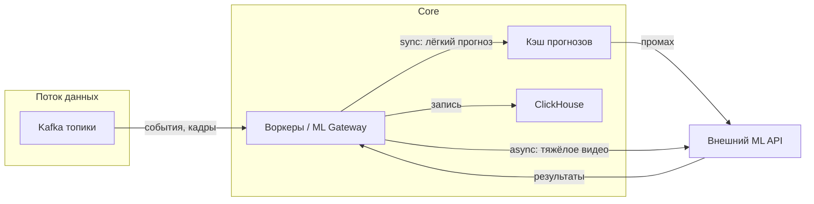

### Лабораторная работа №2
**Тема**: Надёжность и воспроизводимость ML-системы в контуре интеллектуальной транспортной системы (валидация, утечки данных, масштабирование)

**ФИО**: Попов Александр Иванович  
**Группа**: БВТ2203

**Связь с лабораторной работой №1**: архитектура и стек описаны в [high-level-design.md](high-level-design.md). Реализуется **Core-сервис** (Kafka, хранилище S3/ClickHouse, **ML Gateway**, аналитика, Prometheus/Grafana); **ML-сервис** — внешний, доступ только по API. Ниже рассматриваются практики обеспечения надёжности и воспроизводимости ML-контура независимо от того, где физически выполняется обучение и инференс: со стороны интеграции задаются сплиты данных, версии артефактов, требования к API и к масштабированию вызовов.

---

## Шаг 1. Стратегия валидации и воспроизводимость

### 1.1. Стратегия валидации с учётом природы данных

ML-задачи в ИТС (см. лабораторную №1) делятся на прогнозирование трафика по временным рядам, компьютерное зрение по видео и обнаружение редких инцидентов. Для каждой подзадачи выбор стратегии разбиения выборки должен отражать **зависимость наблюдений во времени и пространстве**, а не предполагать независимые одинаково распределённые точки.

| Подзадача | Природа данных | Рекомендуемая стратегия валидации | Обоснование |
|-----------|----------------|-----------------------------------|-------------|
| Прогноз трафика (скорость, плотность, поток по сегментам сети) | Временные ряды с сильной автокорреляцией и сезонностью (часы, дни недели, праздники) | **Временной сплит**: обучение на прошлых интервалах, валидация и тест — на **будущих** относительно train; при необходимости **walk-forward** (скользящее обучение с фиксированным горизонтом теста) | Случайное перемешивание точек **недопустимо**: оно смешивает «прошлое» и «будущее» и завышает метрики относительно реального онлайн-режима |
| Детекция и классификация объектов на видео | Кадры из одной записи камеры сильно коррелируют; соседние кадры почти дублируют сцену | Сплит по **идентификаторам записи/сессии/камеры/дня**, а не по отдельным кадрам | Иначе train и test содержат почти одинаковые сцены, и mAP на тесте не отражает обобщение на новые съёмки |
| Редкие инциденты (ДТП, остановка, аварийная ситуация) | Сильный дисбаланс классов; одно событие может размазано по многим точкам данных | **Group split** по **id инцидента** или по временному окну вокруг события; при стратификации — по типу события, где это осмысленно; отчётность по **Precision/Recall/F1** на отложенном временном периоде | Согласуется с ML-метриками из §3 лабораторной №1; иначе модель переобучается на «шуме нормы» |

**Пространственное обобщение**: если цель — развёртывание на **новых** участках дорог или камерах, целесообразен дополнительный сценарий **spatial holdout**: целые сегменты сети, районы или перекрёстки целиком выводятся только в test. Это обычно даёт более пессимистичные, но честные метрики по сравнению со сплитом только по времени на тех же камерах.

**Итоговая рекомендация**: для отчётности о качестве моделей фиксировать **несколько протоколов** (например: «время train/test» и «пространственный holdout») и явно указывать, какой протокол соответствует каким SLA в проде.

### 1.2. Воспроизводимость экспериментов: что версионировать

Связка с архитектурой лабораторной №1 (данные в S3 и ClickHouse, код Core на Go, вызовы внешнего ML через ML Gateway):

| Компонент | Что фиксируется | Зачем |
|-----------|-----------------|--------|
| **Данные** | Неизменяемые **снимки** выборок: префикс в object storage + версия или контентный **хэш**; для стриминговых выборок — **временное окно** + **версия ETL** (пайплайн из Kafka → фичи) | Повторный прогон обучения на «тех же» данных |
| **Код** | **Git commit** или **тег** репозиториев: подготовка признаков, обучение, постобработка, **ML Gateway** (логика запросов, сериализация входов) | Идентичная логика до и после исправлений |
| **Среда выполнения** | **Docker-образ** с digest (не только `:latest`), `go.sum`, lock-файлы зависимостей Python при GPU-обучении; версии CUDA/driver при необходимости | Исключение «на моей машине работает» |
| **Модели и эксперименты** | **MLflow**, Weights & Biases или **реестр моделей** поставщика ML-сервиса: id модели, версия, гиперпараметры, метрики на **зафиксированном сплите** | Аудит и сравнение прогонов |
| **Конфигурация и контракт** | YAML/JSON с гиперпараметрами; **версия OpenAPI/Proto** для API ML-сервиса; пороги NMS, confidence, частота опроса | Согласованность инференса в Core и при обучении у поставщика |
| **Случайность** | Явные **seed** для инициализации, аугментаций, сэмплирования | Воспроизводимость в пределах детерминизма библиотек |

**Связь с мониторингом (Prometheus + Grafana)**: в проде собираются латентность и ошибки вызовов ML API, доля таймаутов и т.д. Воспроизводимость эксперимента позволяет сопоставить **офлайн-метрику** на отложенном периоде с **онлайн-сигналами** (например, дрейф распределения входов или рост ошибок при той же версии модели). Без зафиксированных данных, кода и версии модели такое сравнение непривязано к причинам расхождений.

---

## Шаг 2. Анализ утечек данных

Для ИТС утечки информации из «будущего», из меток смежных систем или из дублирующихся наблюдений **реалистичны**. Ниже — типичные источники риска, проявление и меры предотвращения.

| Источник риска | Как проявляется | Способ предотвращения |
|----------------|-----------------|------------------------|
| **Временная утечка в признаках** | В признаки попадают агрегаты по **текущему и будущему** окну (например, скользящее среднее без сдвига, или «целевая» переменная косвенно в фичах) | Окна **причинно-ориентированные (causal)**: только данные до момента `t`; одинаковая семантика задержки в **обучении** и в **онлайн-пайплайне** Core |
| **Нормализация и заполнение пропусков** | `fit` масштабирования/импьютации на объединённом train+val+test | Обучение преобразований **только на train**; в прод — сохранённые **статистики и правила** из артефакта обучения |
| **Дубли кадров и перекрывающиеся клипы** | Один и тот же инцидент или одна сцена попадает в train и test из-за разных кропов или соседних кадров | Сплит по **id сессии/клипа**; дедупликация по `(camera_id, time_bucket)`; минимальный интервал между независимыми выборками для видео |
| **Пространственная утечка** | Соседние камеры на одном перекрёстке или разные ракурсы одной сцены в разных сплитах | **Group split** по **перекрёстку, коридору или кластеру** на карте |
| **Метки из городских БД с задержкой** | ДТП или нарушение в train помечены по данным, доступным только через неделю после события | Обучение с **cutoff**: метка используется только если она была бы доступна в момент `t` согласованным лагом; документирование **задержек внесения** записей |
| **Вмешательство системы управления** | В качестве «факта» используются показатели **после** изменения фаз светофора по рекомендациям ИТС | Разделение **сырых измерений** и **результатов управления**; при оценке эффектов — методы оценки политики (off-policy), отдельно от обучения чистого прогноза |

**Когда утечка маловероятна (узкая область)**: для **изолированного синтетического бенчмарка** (например, данные симулятора дорожного движения с полностью контролируемым сценарием и без постфактум-меток) утечка из внешних систем исключена. Это не отменяет рисков **временной** утечки при неправильном формировании окон и сплитов по кадрам внутри симуляции. Такие сценарии следует явно помечать как **не переносимые** на продовые данные ИТС без отдельной проверки.

---

## Шаг 3. Масштабирование и задержки

### 3.1. Оценка нагрузки и допустимая задержка

Нагрузку нужно оценивать **по разным каналам** из архитектуры лабораторной №1: поток событий в Kafka, вызовы внешнего ML через ML Gateway, синхронные запросы операторов и интеграций к Core.

**Допущения для численного примера** (средний городской контур):

| Параметр | Значение | Комментарий |
|----------|----------|-------------|
| Камеры с видеоаналитикой | 200 | Часть потока обрабатывается не с каждого кадра |
| Частота отправки кадров/окон в ML на камеру | 1 запрос в 2 с (0,5 Гц) | Снижение нагрузки за счёт сэмплирования |
| Сегментов дорожной сети с прогнозом трафика | 500 | Один прогноз на сегмент с периодом обновления |
| Период обновления прогноза | 60 с | Периодические вызовы ML Gateway с батчем сегментов или по одному |
| Операторы и внутренние клиенты карты/инцидентов | 30 одновременных пользователей | Пиковые чтения API |

**Оценки потоков:**

- **Кафка (телеметрия, датчики, нормализованные события)** — порядка **10³–10⁴ сообщений/с** при плотной сети датчиков; это не равно RPS к ML API.
- **Вызовы к ML API (видео)**:
  - Базовая средняя нагрузка: \(200 \times 0{,}5 \approx 100\) запросов/с.
  - Пик (например, +30% на утренний/вечерний час): **~130 запросов/с** только по видео-ветке.
- **Прогноз трафика**: \(500 / 60 \approx 8{,}3\) запросов/с в среднем при посекундном разнесении; при батчировании сегментов — меньше **числа HTTP-запросов**, но с крупнее телом запроса. Пиковый коэффициент по расписанию (например, ×2) — **~**15–20 эквивалентных запросов/с по сегментам.
- **Синхронные API Core для операторов/интеграций** (карта, инциденты, ETA): при 30 пользователях и условно 1 запрос/с на пользователя в пике — **~30 RPS**; для публичных интеграций множитель может быть выше.

**Целевые SLA по задержке (пример):**

| Сценарий | Целевой p95 latency | Пояснение |
|----------|---------------------|-----------|
| Синхронный прогноз по фичам для короткого горизонта | ≤ 300 ms | Управление и навигаторы ожидают быстрый ответ |
| Видео-инференс (тяжёлый) | ≤ 2–5 s p95 или **асинхронный** режим | Допустима очередь, если алерт не блокирует UI |
| Офлайн пересчёт агрегатов и отчётов | минуты | Не в пользовательском критическом пути |

**Средний vs пиковый трафик**: для ML вызовов разумно закладывать **пиковый коэффициент 1,5–2** относительно среднего за сутки (часы пик, ДТП, сбои, всплеск перезапросов). Для Kafka — отдельный запас по **consumer lag** и партициям.

### 3.2. Масштабирование при росте нагрузки

Связка с выбранным стеком (**Kubernetes**, **Kafka**, горизонтальное масштабирование сервисов Core):

- **Горизонтальное масштабирование**: несколько реплик **ML Gateway** и воркеров, читающих топики Kafka и вызывающих ML API; **HPA** в Kubernetes по CPU, памяти, длине очереди или пользовательским метрикам (экспорт в Prometheus).
- **Синхронный vs асинхронный инференс**:
  - **Лёгкие** запросы (прогноз по табличным фичам) — **синхрон** с таймаутом и **кэшем** по ключу `(segment_id, time_bucket)`.
  - **Тяжёлое видео** — **очередь** (Kafka или внутренняя), **асинхронная** обработка, результат пишется в ClickHouse и поднимает событие для аналитики; при необходимости callback/Webhook.
- **Кэширование**: кэш прогнозов с **TTL** (например, 30–60 с) снижает дублирующие вызовы к внешнему ML при одинаковых срезах; **идемпотентные** ключи запросов.
- **Разделение критичных путей**: отдельные **лимиты и очереди** для высокоприоритетных алертов (инциденты) и фоновой аналитики.
- **Внешний ML-сервис**: масштабирование по **договору** (квоты RPS, отдельные эндпоинты для GPU); при недоступности — **деградация** (повторный прогон с backoff, использование последнего валидного прогноза, резервные эвристики), как уже предполагается в контуре мониторинга лабораторной №1.

Кратко: рост нагрузки покрывается **партицированием Kafka**, **репликами** воркеров и Gateway, **кэшем** и **разделением** синхронных и асинхронных путей; узкое место **внешнего ML** снимается квотами, батчированием и при необходимости отдельным масштабированием на стороне поставщика по согласованному контракту.

---

### Ссылки на источники (для справки)

- [Apache Kafka Documentation](https://kafka.apache.org/documentation/)
- [Kubernetes Horizontal Pod Autoscaling](https://kubernetes.io/docs/tasks/run-application/horizontal-pod-autoscale/)
- [Prometheus Documentation](https://prometheus.io/docs/introduction/overview/)
