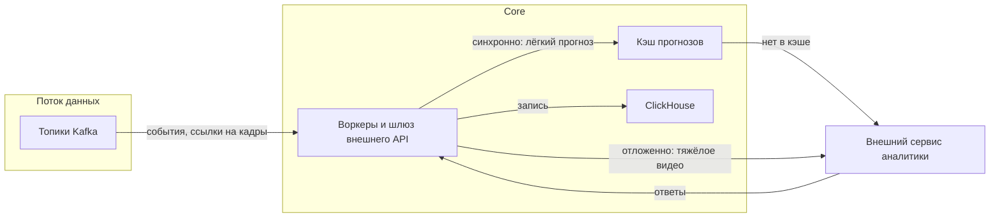

### Лабораторная работа №2
**Тема**: Надёжность и воспроизводимость ML-системы в контуре интеллектуальной транспортной системы (валидация, утечки данных, масштабирование)

**ФИО**: Попов Александр Иванович  
**Группа**: БВТ2203

---

## Шаг 1. Стратегия валидации и воспроизводимость

### 1.1. Стратегия валидации: данные на входе и компоненты Core

#### Работа сервисов Core

| Компонент | Что считается успешной работой | Как валидируем |
|-----------|-------------------------------|----------------|
| **Data Ingestion** | Сообщения приняты, нормализованы и попали в Kafka с приемлемой задержкой | Метрики: принятые/отклонённые события, задержка end-to-end до брокера, ошибки по типам; синтетические **heartbeat**-источники или контрольные файлы в тестовом контуре |
| **Kafka → потребители → Data Lake** | Нет неконтролируемого отставания консьюмеров | Lag по группам, время записи в ClickHouse/S3; алерты на рост lag; нагрузочные прогоны с известным RPS |
| **ML Gateway** | Запросы к внешнему ML укладываются в SLO, ответы разборчивы и сохраняются | Latency p95/p99, доля ошибок и таймаутов, распределение кодов ответа API ML; **контрактные тесты** на фиксированных запросах (golden requests); сравнение структуры ответа со схемой |
| **Analytics & Orchestration** | Операторский API и оркестрация выдают согласованные сущности (карта, инциденты) | Интеграционные тесты API, проверка согласованности агрегатов с сырыми событиями на контрольном датасете; метрики бизнес-событий (число алертов, время прохождения пайплайна) |
| **Integration Adapters** | Команды наружу не ломают протокол и получают подтверждения где требуется | Тестовые стенды внешних систем или моки; метрики успешных/неуспешных вызовов |

Наблюдаемость (**Prometheus** scrape `/metrics`, **Grafana**, алерты) — основной **непрерывный** способ валидации сервисов в эксплуатации; автоматические тесты — **способ валидации при изменениях** кода и конфигурации.

Полезность итоговых решений для эксплуатации дополнительно отражают **операционные показатели** из ЛР1 — в частности **доля подтверждённых оператором результатов** и **время реакции** на инциденты.

#### Валидация данных

| Источник данных | Природа данных | Стратегия контрольных выборок | Обоснование |
|-----------------|----------------|------------------------------|-------------|
| Телеметрия транспортных средств | Временные ряды координат, скорости и связанных величин; сильная автокорреляция и зависимость от времени суток | Разделение по времени: эталон на более ранних интервалах, проверка на более поздних; при необходимости пошаговое смещение окна по времени | Случайное перемешивание смешивает ранние и поздние наблюдения и завышает оценки относительно реального потока |
| Дорожные датчики и стационарная инфраструктура | Ряды петель, загруженности, метеоданных; пропуски и разная частота по объектам | Разделение по времени на уровне объектов/сегментов; для проверки переноса на новые участки — целиком выводить сегменты или районы только в контрольную часть | Иначе оценка опирается на пространственные шаблоны базовых участков и завышает качество на новых |
| Видеопотоки с камер наблюдения | Последовательности кадров; соседние кадры и смены сильно коррелированы | Разделение по записи, смене, id камеры или суткам, не по отдельным кадрам; при нескольких камерах на объекте — по группе камер или перекрёстку | Иначе в базовой и контрольной частях оказываются почти одинаковые сцены |
| Городские информационные системы и архивы событий | Справочники, архивы ДТП/нарушений, история трафика; метки с задержкой | Разделение по времени с учётом момента фиксации в источнике; для редких событий — по id инцидента или окну; на отложенном периоде — сверка полноты и точности фиксации событий с эталоном | Редкие классы событий и риск «будущих» меток при обновлениях архива |

### 1.2. Версионирование

#### Собственные сервисы Core

В проекте пишутся и деплоятся отдельные процессы/микросервисы на **Go**. Для воспроизводимости каждого релиза фиксируют:

| Артефакт | Что именно фиксировать | Зачем |
|----------|------------------------|--------|
| Исходный код | **Git-тег** релиза | Однозначная привязка к логике нормализации, вызовов внешних API, агрегаций |
| Сборка | Версия **Go** из `go.mod`; при необходимости флаги сборки | Повторяемость компиляции |
| Поставка в кластер | Версия **Helm chart** / набора манифестов и **values**, указывающие образ с digest | Совпадение реплик, лимитов, переменных окружения |

#### Инфраструктура

**Kafka**, **ClickHouse**, **PostgreSQL** (если используется), объектное хранилище, **Prometheus**, **Grafana** и аналоги в рамках работы **не разрабатываются** — это готовые продукты. Для них не вводится «свой» семвер релиза в прикладном репозитории; вместо этого в инфраструктурном слое **стоят зафиксированные версии**:

#### Версионирование данных

| Объект | Что версионировать |
|--------|-------------------|
| **Телеметрия ТС** | Неизменяемый снимок за интервал: id выгрузки или **префикс/объект в S3**, **контентный хэш**; для стрима — границы окна по времени, **имя топика Kafka** и **версия схемы сообщений** (JSON Schema / protobuf), **версия правил нормализации** Data Ingestion |
| **Датчики и инфраструктура** | Аналогично по типу датчика/топику; при разрезании по сегментам — отдельный снимок или префикс; **номер миграции или контрольная сумма DDL** таблиц/материализованных представлений **ClickHouse** на момент фиксации выборки |
| **Видео с камер** | Снимок клипов в **объектном хранилище**; |
| **Городские ИС** | **Дата/номер выгрузки** справочников; для архивов — **момент среза** плюс правила отсечения меток по времени доступности; версия **дампа/файла** в хранилище |

---

## Шаг 2. Анализ утечек данных ???

**Телеметрия транспортных средств.** Частый сбой — в состав показателей для расчёта попадают измерения из более позднего времени, чем момент, для которого принимается решение. Чтобы этого не было, все усреднения и накопления нужно строить только из данных, которые уже поступили к выбранному моменту времени.

**Дорожные датчики и описание сети.** В расчёт попадает справочник дорог или статус участка таким, каким он стал позже интересующей даты, хотя тогда эти сведения ещё не существовали. Нужно явно привязать справочники и схему сети к дате среза.

**Видео с камер.** Нельзя для разметки или расчёта кадра использовать кадры, которые в реальном времени ещё не успели бы прийти. Все входы для решения в момент времени *t* должны опираться только на уже доступную часть потока. Отдельно важно не резать одну и ту же запись или одно и то же окно по времени между «настройкой» и «проверкой»: иначе в обеих попадаются почти одинаковые картинки. Имеет смысл делить по номеру камеры, по смене записи или по целым отрезкам без пересечения.

**Городские базы и архивы событий.** Запись о происшествии часто появляется с задержкой; если не учитывать эту задержку, в проверочную выборку попадают сведения, которые на самом деле стали известны позже. Нужно моделировать или задавать правило: какие события считаются «уже внесёнными» к выбранному моменту времени.

---

## Шаг 3. Масштабирование и задержки

### 3.1. Исходные допущения (средний городской контур)

| Параметр | Значение | Обоснование |
|----------|-----------|-------------|
| Камеры с видеоаналитикой | 150 | Потоковая обработка по окнам |
| Окно анализа на камеру | 1 раз в 4 с | Не каждый кадр, тяжёлый анализ |
| Сегментов дороги с периодическим прогнозом | 600 | Участки сети |
| Период обновления прогноза | 60 с | Раз в минуту по расписанию |
| Коэффициент пика | 1,4 | Час пик, всплеск при инцидентах |
| Операторов с активным интерфейсом в пике | 20 | Карта, статусы |
| Запросов обновления на одного оператора | 0,4 в 1 с | В среднем раз в ~2,5 с |

### 3.2. Запросы в секунду (оценка)

| Канал | Среднее, запросов/с | Пик, запросов/с | Как получено |
|-------|---------------------|-----------------|---------------|
| Внешнее API: видео по камерам | ≈ 38 (`150 / 4`) | ≈ 53 (`× 1,4`) | Одно обращение на камеру на окно 4 с |
| Внешнее API: прогноз по сегментам | ≈ 10 (`600 / 60`) | ≈ 14 | Один запрос на сегмент раз в минуту, равномерно |
| **Итого к внешнему API** | **≈ 48** | **≈ 67** | Сумма двух строк |
| HTTP к модулю аналитики Core (операторы) | ≈ 8 | ≈ 12 | `20 × 0,4` и с запасом пика |

Для проектирования внешнего контракта имеет смысл закладывать **около 50–70 обращений в секунду** к внешнему API с возможностью роста при увеличении числа камер или частоты обновления прогноза.

### 3.3. Средний и пиковый трафик (порядок величины)

Точные мегабайты зависят от формата телеметрии, сжатия кадров и размера ответов. Ниже — **иллюстративная** оценка, чтобы согласовать с сетью и дисками.

| Поток | Допущение | Среднее | Пик |
|-------|------------|---------|-----|
| **Kafka**: телеметрия, датчики, события приёма | ~10 000 сообщ/с, ~1 КБ на сообщение в среднем | ~10 МБ/с | ~14 МБ/с (`× 1,4`) |
| **Kafka / исходящий**: те же порядки после нормализации | может быть несколько топиков | того же порядка, смотреть по факту | |
| **HTTP к внешнему API** (тело запроса) | средний запрос ~200–400 КБ (сжатый кадр или табличный срез) при **48** запросах/с | ~10–20 МБ/с | ~15–30 МБ/с при пике **67** запросов/с |

### 3.4. Допустимая задержка ответа

| Сценарий | Целевое время ответа | Пояснение |
|----------|----------------------|-----------|
| Короткий табличный прогноз по запросу оператора или интеграции | не более **300 мс** для 95% обращений | Синхронный путь к внешнему API + ответ Core |
| Тот же сценарий для страниц оператора целиком | не более **500 мс – 1 с** для 95% | Сбор агрегатов из хранилища, несколько внутренних шагов |
| Обработка тяжёлого видеоокна | **3–6 с** для 95% окон **или** результат по готовности без блокировки экрана | Асинхронная очередь, статус в интерфейсе |
| Фоновые отчёты и тяжёлые пересчёты | минуты и выше | Вне критического пути |

### 3.5. Как масштабировать при росте нагрузки

**Паттерны уровня приложения.**

- **Синхронный путь** — когда ответ нужен при открытии экрана: короткий таймаут, ограничение параллелизма, при необходимости **кэш прогнозов** на **30–60 секунд** по ключу «сегмент + временной интервал», чтобы не дублировать одинаковые вызовы внешнего API.
- **Отложенный путь** — тяжёлые видеоокна: сообщение в **Kafka**, воркеры обрабатывают в фоне, результат пишется в **ClickHouse** и подтягивается в интерфейс по готовности; так пик по одновременным длительным вызовам сглаживается.
- **Разделение очередей** — отдельные лимиты для срочных оповещений и для массовой фоновой аналитики, чтобы одно не блокировало другое.
- **Внешний сервис аналитики** — договорные лимиты запросов в секунду, отдельные ресурсы под пик; при сбое — повтор с паузой, показ последнего успешного прогноза при наличии мониторинга.

**Сервисы на Go в Kubernetes.** В манифесте **Deployment** задаётся поле **`replicas`** (число копий пода). **Service** типа **ClusterIP** или **LoadBalancer** направляет входящие соединения на эти поды с **балансировкой нагрузки**. Число реплик можно менять вручную или через **горизонтальное масштабирование подов** (Horizontal Pod Autoscaler): он увеличивает или уменьшает `replicas` по процессору, памяти или по **пользовательским метрикам** (например, длина очереди из **Prometheus**). Подробнее: [разделы про Deployment и HPA](https://kubernetes.io/docs/concepts/workloads/controllers/deployment/) в документации Kubernetes.

**Apache Kafka.** Нагрузку по записи и чтению распределяют **несколько брокеров** в кластере; у каждого **топика** задаётся число **разделов**. Потребители в одной **группе** распределяют разделы между собой: **максимальный параллелизм чтения по топику ограничен числом разделов** (один раздел в каждый момент закрепляется за одним потребителем в группе). При росте потока увеличивают число разделов (с учётом ключа сообщений и порядка) и число экземпляров воркеров на Go. Описание модели топиков и потребителей: [документация Apache Kafka](https://kafka.apache.org/documentation/).

**ClickHouse.** Для больших объёмов и высокой нагрузки на запросы используют **кластер**: данные делят по **шардам**, при необходимости добавляют **реплики** для отказоустойчивости и разгрузки чтения; **распределённые таблицы** позволяют отправлять запрос на все релевантные шарды и собирать результат на координирующем узле. Это штатный способ горизонтального масштабирования аналитического хранилища. Обзор: [развёртывание кластера и репликация](https://clickhouse.com/docs/architecture/cluster-deployment) в документации ClickHouse.

Итого рост нагрузки закрывается сочетанием **увеличения реплик Go-сервисов в Kubernetes**, **разделов и потребителей Kafka**, **масштабирования кластера ClickHouse** по документации и **кэша с синхронным и отложенным** вызовом внешнего API.

---

### Ссылки на документацию (для справки)

- [Apache Kafka — документация](https://kafka.apache.org/documentation/)
- [Kubernetes — Deployment, работа с репликами](https://kubernetes.io/docs/concepts/workloads/controllers/deployment/)
- [Kubernetes — горизонтальное масштабирование подов (HPA)](https://kubernetes.io/docs/tasks/run-application/horizontal-pod-autoscale/)
- [ClickHouse — кластер, шарды и реплики](https://clickhouse.com/docs/architecture/cluster-deployment)
- [Prometheus](https://prometheus.io/docs/introduction/overview/)
